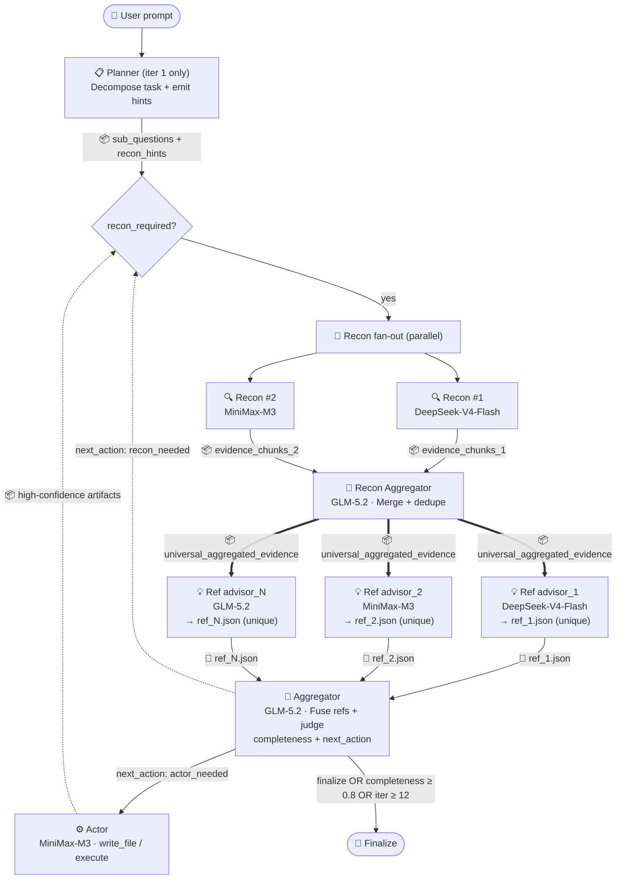

# vscode-moa

> 🌐 **Languages / 语言**: **English (current)** | [中文](./README.md)

**Mixture-of-Agents (MoA) for VSCode Copilot Chat** — orchestrates a streamlined 5-role pipeline (Planner → Recon → Refs → Aggregator → Actor) through the native `vscode.lm` API, letting multiple LLMs collaborate as heterogeneous advisors.
>
> *Chinese-speaking users: see [README.md](./README.md).*

[](./LICENSE)
[](https://code.visualstudio.com)
[](https://marketplace.visualstudio.com/items?itemName=dudali095.moa-bridge)
[](https://github.com/DDL095/vscode-moa/releases/latest)

> ⚠️ **Default Autopilot mode (v0.21.3+)** — New installs default to `moa.executionPreset="autopilot"` + `moa.enableActorInLoop=true`. After task convergence, the Actor role **automatically executes** `action_items` (write files, run terminal commands) with SafeExecutor `.bak.<timestamp>` backup. Audit trail: `.moa_cache/<task_id>/manifest.json`. To opt out: set `moa.executionPreset="manual"` (finalize returns markdown only) or `"supervised"` (Gate-A QuickPick approval before each round).

## What it does

`@moa <your question>` runs a multi-model fan-out directly in Copilot Chat. Three entry points:

| Entry | Use case | Loop shape |
|---|---|---|
| `@moa` / `@moaloop` | Iterative refinement until Aggregator converges | Hermes loop, up to `MAX_ITER=12` |
| `@moasingle` | Fast single-shot | 1 iteration, forced finalize |
| `#moa_orchestrate` / `#moa_continue` / `#moa_finalize` | Drive loop from another agent | Hermes loop, disk-persisted state |
| `#moa_analyze` / `#moa_recon` / `#moa_execute` | One-shot analysis / read-only collection / execute action_items | No loop |

## Pipeline overview

Each iteration runs all 5 roles in sequence. The loop terminates when Aggregator emits `finalize` (completeness ≥ 0.8) or hits `MAX_ITER=12`.



> 📦 = file / packaged payload · 📄 = JSON file
> 📖 **For detailed data flow + per-role input/output JSON shapes**, see [docs/ARCHITECTURE.md](./docs/ARCHITECTURE.md).

> **ℹ️ Rendering**: GitHub, VSCode Marketplace, and VSCode 1.58+ built-in markdown preview all render mermaid natively.

## Model selection guide

MoA is vendor-agnostic — there are **no hardcoded model IDs** in the codebase. Each layer reads its model from `moa.*` config. Recommendations for each role:

| Role | Recommended model traits | Why | Examples (with GCMP) |
|---|---|---|---|
| **Planner** | Strong logic, long context | Runs once; does task decomposition + sub_questions | GLM-5.2 / Claude Sonnet |
| **Recon** | **Cheap + fast** + stable tool-calling | N parallel per iter, tool-heavy — expensive models burn budget | DeepSeek-V4-Flash + MiniMax-M3 |
| **Recon Aggregator** | Strong fusion reasoning | Dedupes + integrates N raw evidence streams — needs quality | GLM-5.2 (CodingPlan) |
| **Refs** | **Diversity first** (different labs/training data) | MoA's core value is heterogeneous perspective — same family = no real fan-out | DeepSeek-V4-Flash + MiniMax-M3 + GLM-5.2 + Qwen3 |
| **Aggregator** | **Strong logic + synthesis** | Decides next_action and completeness score — source of truth for convergence | GLM-5.2 (CodingPlan) / Claude Sonnet |
| **Actor** | **High compliance** + disciplined tool-calling | Actually executes `write_file` / `execute` — more obedient = safer | MiniMax-M3 (TokenPlan) / GLM-5.2 |
| **L3 Summarizer** | Cheap + good at compression | Preprocessing for huge files (>200k chars); volume-heavy but simple task | MiniMax-M3 (TokenPlan) |

**Pairing with GCMP**: With only official Copilot, MoA sees 3-5 models. With [GCMP](https://marketplace.visualstudio.com/items?itemName=vicanent.gcmp) installed, it expands to 10-30+ (DeepSeek-V4-Pro/Flash, GLM-5.2, MiniMax-M3, Qwen3, etc.) — true heterogeneous MoA.

## Install

**Option A — Marketplace (recommended)**: Extensions panel → search **"MoA Bridge"**, or `code --install-extension dudali095.moa-bridge`.

**Option B — GitHub Release**: Download `.vsix` from [releases](https://github.com/DDL095/vscode-moa/releases), then `code --install-extension moa-bridge-X.Y.Z.vsix`.

**Option C — From source**:

```bash
git clone https://github.com/DDL095/vscode-moa.git
cd vscode-moa && npm install
npm run package && code --extensionDevelopmentPath .
```

## First-run config

**Easiest — run `Moa: Configure Models` from Command Palette**: 8-step guided flow. All steps except refs (Step 1) and recon (Step 3) provide "Use aggregator" / "Disable" sentinels as recommended defaults.

**Manual `settings.json`** — the maintainer's working config (balanced for daily coding + deep research):

```jsonc
{
  "moa.activePreset": "default",
  "moa.presets": {
    "default": {
      "name": "Daily coding + research",
      // 4 ref advisors — from different labs, heterogeneous perspectives
      "refModels": [
        { "role": "advisor_1", "model": "DeepSeek-V4-Flash" },
        { "role": "advisor_2", "model": "MiniMax-M3" },
        { "role": "advisor_3", "model": "GLM-5.2" },
        { "role": "advisor_4", "model": "Qwen3" }
      ],
      "aggregator":     { "model": "GLM-5.2" },        // strong logic, decides convergence
      "reconModels": [                                 // cheap + fast, different tool prefs
        { "model": "DeepSeek-V4-Flash" },
        { "model": "MiniMax-M3" }
      ],
      "reconAggregator": { "model": "GLM-5.2" },       // default = aggregator
      "planner":         { "model": "GLM-5.2" },       // default = aggregator
      "actor":           { "model": "MiniMax-M3" },    // high compliance
      "l3Summarizer":    { "model": "MiniMax-M3" }     // large-file compression
    }
  }
}
```

`model` is matched as a **substring** against `LanguageModelChat.id` (e.g. `"GLM-5.2"` matches `gcmp.zhipu:::GLM-5.2-CodingPlan`). Config persists to both User and Workspace scopes — no manual sync across windows.

> 💡 **Preset switching**: Save multiple presets (e.g. `code` / `research` / `quick`), switch via `Moa: Switch Preset`.

## Usage

**As a chat participant (simplest)**:

```
@moa refactor src/moaRunner.ts to extract the sufficiency loop into its own module
@moa analyze the design trade-offs of this PR from multiple angles
@moa review the auth flow in src/services/auth/
```

**As VSCode LM tools (composable, from other agents)**:

| Tool | Purpose |
|---|---|
| `#moa_recon` | Standalone read-only file collection — returns structured Markdown summary |
| `#moa_analyze` | One-shot MoA — N refs + 1 aggregator, no loop |
| `#moa_orchestrate` | Start iterative loop, returns `task_id` (supports `deferredResultId` across compaction) |
| `#moa_continue` | Advance loop (optionally inject subagent's `reconResult` to fill gaps) |
| `#moa_finalize` | Terminate loop, produces `action_items` + summary + gaps |
| `#moa_execute` *(v0.20.0+)* | Execute finalized `action_items`, subject to approval gates |

## Pipeline visibility

5 independent OutputChannels (`View → Output` dropdown): `MoA Planner` / `MoA Recon` / `MoA Refs` / `MoA Aggregator` / `MoA Actor`. Each channel has iteration boundary headers (`═══════ iter N ═══════`) for easy scrolling in multi-iter runs.

## Actor execution control (v0.20.0+)

The Actor role actually *executes* the Aggregator's `action_items` (writes files / runs commands / produces side effects). 4+1 `executionPreset` modes:

| Preset | Auto-execute after finalize? | Approval popups | Backup | Use case |
|---|---|---|---|---|
| `manual` (default) | ❌ requires `#moa_execute` | `batch` (Gate-A QuickPick) | ✅ | First-time / exploratory |
| `supervised` | ✅ | `batch` (multi-select per round) | ✅ | Human-monitored |
| `autopilot` | ✅ | `none` | ✅ | CI / trusted batch |
| `yolo` | ✅ | `none` | ❌ (irreversible) | Sandbox |
| `custom` | controlled by `autoExecuteAfterFinalize` | controlled by `approvalMode` | controlled by `safeExecutionMode` | Fine-grained |

Every side-effecting action is logged to `.moa_cache/<task_id>/manifest.json`; when `safeExecutionMode: true`, backed up to `<target>.bak.<timestamp>`. Rollback = delete new file + rename `.bak.<ts>` back.

## v0.22: Role injection overhaul + user sovereignty

> **Theme** (user's words): "A personal MOA mistletoe growing inside VSCode" — gives users complete sovereignty over LLM role identities, while upgrading Planner into an iterable intelligent router. Full design: [docs/roadmap/v0.22.0-role-injection-overhaul.md](./docs/roadmap/v0.22.0-role-injection-overhaul.md) v3.

### 4 major changes

#### 1. Planner mini-loop + role_setup designer

Planner upgraded from "single-call" to "iterable mini-loop" (default up to 5 iterations, hard cap 20). Self-evaluates `plan_coverage ≥ 0.9` to converge. iter 2+ may call read-only tools (`read_file`/`list_dir`/`grep_search`/`get_errors`, max 3 calls per iter). When `plan_coverage < 0.5`, triggers `vscode_askQuestions` to ask the user.

**Planner's new role**: designs the identity (tone / perspective / tool_priority / cautions / focus) of the 3 downstream roles (recon / recon_aggregator / actor) via the `role_setup` field. Refs and Aggregator keep multi-model comparability and **do not** accept role_setup (architectural red line).

#### 2. Infrastructure layer injection (all tool-calling roles)

New `systemContext.ts` + `instructionScanner.ts` inject 4 dynamic context segments to Planner / Recon / Actor:

| Segment | Content |
|---|---|
| `ENV_CONTEXT` | activeFile / openDocs / workspaceFolders / projectTree / gitRoot / instructionFiles list |
| `TOOL_EFFICIENCY` | static tool-call discipline template |
| `CUSTOM_INSTRUCTIONS` | **7-path instruction file scan** (CLAUDE.md / AGENTS.md / copilot-instructions.md etc.), **no truncation** |
| `RUNTIME_INSTRUCTIONS` | SKILL.md frontmatter from **4 skill folders** (.github/skills + .claude/skills + ~/.copilot/skills + ~/.claude/skills) |

#### 3. Recon Aggregator always runs + self-iteration

Since v0.18 Recon Aggregator runs in parallel mode; **since v0.22 it always runs (single or parallel)** for unified evidence cleanliness. Supports self-iteration (default 1, max 10). When `maxIterations > 1`, enables heuristic scoring (aggregation + fidelity, zero extra LLM cost).

#### 4. Role Setup Preset — user sovereignty system

Like moa model presets, adds a Role Setup Preset system. Presets persist to `~/.moa/role-setup-presets.json` (global, across tasks/sessions). Only 1 built-in `default` preset (cannot be deleted); users modify from default.

### v0.22 commands (11 new)

**Role Setup Preset CRUD + sharing**:
- `Moa: Create Role Preset` / `Switch Role Preset` / `Edit Role Preset` / `Delete Role Preset`
- `Moa: Export Role Preset` / `Import Role Preset` (community sharing)

**Sovereignty + reporting**:
- `Moa: Toggle AI Generation` (toggle acceptance of AI-generated preset suggestions)
- `Moa: Toggle Plan Mode Report` / `Moa: Show Last Plan Mode Report` (inspired by Copilot Plan Agent, MoA as backbone)
- `Moa: Toggle final.md Inline Display` (inline final.md key content into main session on task complete)

**Diagnostics**:
- `Moa: Diagnose Environment (v0.22)` (12 source availability checks)

### v0.22 config items (12 new)

Full details: [docs/CONFIGURATION.md](./docs/CONFIGURATION.md). Top 4:

| Key | Default | Description |
|---|---|---|
| `moa.enablePlannerIteration` | `true` | Planner mini-loop toggle. **Disable to fall back to v0.21.x single-call mode** — backward-compat switch. |
| `moa.plannerMaxIterations` | `5` | mini-loop max iterations (1-20). `1` = single-call mode. |
| `moa.plannerCoverageThreshold` | `0.9` | plan_coverage convergence threshold. |
| `moa.reconAggregatorMode` | `"default"` | Recon Aggregator role prompt source (`default` built-in / `planner` uses role_setup override). |

Other 8: `moa.plannerAllowTools` / `moa.reconAggregatorMaxIterations` / `moa.reconAggregatorScoreThreshold` / `moa.planModeReport.enabled` / `moa.finalMdInlineDisplay` / `moa.finalMdInlineThresholds` / `moa.roleSetup.activePreset` / `moa.roleSetup.aiGeneration`.

### Upgrade path (from v0.21.x)

- role_setup is optional (Planner may omit it; downstream falls back to v0.21.x static prompts)
- `enablePlannerIteration=false` or `plannerMaxIterations=1` → revert to v0.21.x single-call Planner
- First launch auto-creates `~/.moa/role-setup-presets.json` with `default` preset

## Local cache

All task state persists to `<workspace>/.moa_cache/<task_id>/`:

```
.moa_cache/<task_id>/
├── state.json              # live state (updated every iteration)
├── meta.json               # aggregated metadata (models / timings / role breakdown)
├── timeline.md             # human-readable per-iteration table
├── final.md / final.json   # Aggregator synthesis / structured action_items
├── manifest.json           # SafeExecutor audit log (v0.19.1+)
├── autopilot.log           # v0.20.0+ autopilot execution summary
└── iteration_001/
    ├── planner.json
    ├── recon/advisor_1__<model>.json
    ├── recon_aggregator.json
    ├── refs/advisor_N__<model>.json
    ├── aggregator.json
    └── actor.json (if Actor ran)
```

Lifecycle: `moa.cacheTtlDays` (default 30 days, `0` = never auto-cleanup); `moa.cacheRootDir` accepts absolute path for cross-workspace sharing.

## Configuration reference

> 📖 The VSCode settings UI descriptions have been fully bilingual (CN + EN) since v0.20.2. For the complete config reference, see [docs/CONFIGURATION.md](./docs/CONFIGURATION.md). This section lists only the most common.

| Key | Type | Default | Description |
|---|---|---|---|
| `moa.presets` | `Object` | `{}` | Named preset groups, each packaging the whole pipeline. Switch via `Moa: Switch Preset`. |
| `moa.activePreset` | string | `"default"` | Currently active preset key. |
| `moa.parallelRefs` | boolean | `true` | Parallel fan-out for refs (wall-clock = slowest ref). |
| `moa.parallelRecon` | boolean | `true` | Parallel fan-out for Recon agents (when `reconModels` has 2+). |
| `moa.refDisplayMode` | `"thinking"` \| `"verbose"` | `"thinking"` | **Keep `thinking`** (default). `verbose` pollutes Copilot context (N refs × M iters accumulate thousands of tokens). |
| `moa.enableRecon` | boolean | `true` | Toggle Recon phase. |
| `moa.enableActingAgent` | boolean | `true` | Toggle Actor phase. |
| `moa.forceDirect` | boolean | `false` | ⚠️ **Bypasses multi-model safety net** — only use after repeated failures. |
| `moa.maxReconRounds` | number (1-20) | `3` | Sufficiency loop cap. |
| `moa.executionPreset` | enum | `"manual"` | Actor execution mode (see above). |
| `moa.cacheTtlDays` | number (0-36500) | `30` | Task TTL (days), `0` = never cleanup. |

## Debugging

- **`Moa: Probe Available Tools`** — lists all registered `vscode.lm.tools`.
- **5 OutputChannels** (`View → Output`) — per-role per-iter output.
- **End-to-end audit**: full trace in `.moa_cache/<task_id>/iteration_NNN/`; `autopilot.log` is human-readable summary.
- Set `"moa.refDisplayMode": "verbose"` to debug aggregator fusion (⚠️ context pollution risk).

## Relationship with GCMP

**MoA is vendor-agnostic** — it does not import, configure, or depend on [GCMP](https://marketplace.visualstudio.com/items?itemName=vicanent.gcmp). But MoA is more useful with GCMP installed — the whole point of multi-model fan-out is heterogeneous perspective, which is limited with only official Copilot.

## Build & release

```bash
npm install
npm run compile      # dev bundle
npm run package      # production bundle
npx vsce package     # build .vsix
```

Published to [GitHub Releases](https://github.com/DDL095/vscode-moa/releases) — each release includes the corresponding `.vsix`.

## License

[MIT](./LICENSE) © DDL095
