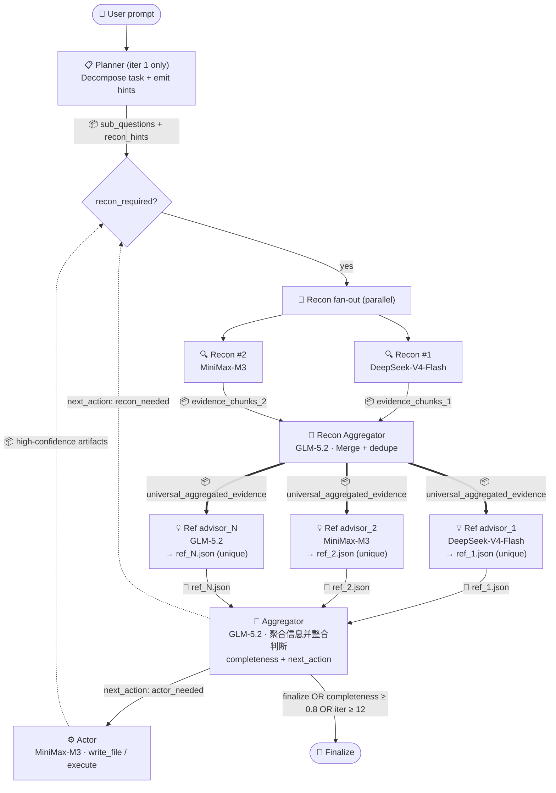

# vscode-moa

> 🌐 **Languages / 语言**: [English](./README.en.md) | **中文（当前 / Current）**

**面向 VSCode Copilot Chat 的混合专家智能体（MoA）** —— 通过原生 `vscode.lm` API 编排精简的 5 角色流水线（Planner → Recon → Refs → Aggregator → Actor），让多个 LLM 异构协作。
>
> *English: Mixture-of-Agents for VSCode Copilot Chat — orchestrates 5-role pipeline through native `vscode.lm` API. See [README.en.md](./README.en.md).*

[](./LICENSE)
[](https://code.visualstudio.com)
[](https://marketplace.visualstudio.com/items?itemName=dudali095.moa-bridge)
[](https://github.com/DDL095/vscode-moa/releases/latest)

> ⚠️ **Default Autopilot mode (v0.21.3+)** — New installs default to `moa.executionPreset="autopilot"` + `moa.enableActorInLoop=true`. After task convergence, the Actor role **automatically executes** `action_items` (write files, run terminal commands) with SafeExecutor `.bak.<timestamp>` backup. Audit trail: `.moa_cache/<task_id>/manifest.json`. To disable: set `moa.executionPreset="manual"` (finalize returns markdown only) or `"supervised"` (Gate-A QuickPick approval before each round).
>
> *English: v0.21.3+ defaults to autopilot + Actor-in-loop. After convergence, Actor auto-executes action_items with SafeExecutor backup. To opt out: `manual` (markdown only) or `supervised` (Gate-A approval).*

## 它能做什么 / What it does

`@moa <your question>` 在 Copilot Chat 中运行多模型扇出。三种入口：

| 入口 | 场景 | 形态 |
|---|---|---|
| `@moa` / `@moaloop` | 迭代优化直到 Aggregator 收敛 | Hermes loop，最多 `MAX_ITER=12` 轮 |
| `@moasingle` | 快速单次 | 1 轮，强制 finalize |
| `#moa_orchestrate` / `#moa_continue` / `#moa_finalize` | 从另一个 agent 驱动 loop | Hermes loop，状态落盘 |
| `#moa_analyze` / `#moa_recon` / `#moa_execute` | 单次分析 / 只读收集 / 执行 action_items | 无 loop |

## 流水线总览 / Pipeline overview

每轮迭代按顺序运行 5 个角色。Aggregator 输出 `finalize`（完整度 ≥ 0.8）或达到 `MAX_ITER=12` 时收敛。



> 📦 = 文件/封装内容传递 · 📄 = JSON 文件
> 📖 **详细数据流 + 每个角色的输入/输出 JSON 结构**见 [docs/ARCHITECTURE.md](./docs/ARCHITECTURE.md)。

> **ℹ️ 渲染说明**：GitHub、VSCode Marketplace、VSCode 1.58+ 自带 markdown preview 都原生支持 mermaid。

## 模型选用指南 / Model selection guide

MoA 是 vendor-agnostic 的 —— 代码中**没有硬编码任何 model ID**。每一层从 `moa.*` 配置读取。下面是**每种角色适合什么类型的模型**的推荐：

| 角色 | 推荐模型特性 | 为什么 | 示例（搭配 GCMP 时） |
|---|---|---|---|
| **Planner** | 逻辑强、长上下文 | 只跑 1 次，要做任务分解 + 生成 sub_questions | GLM-5.2 / Claude Sonnet |
| **Recon** | **便宜 + 快** + 工具调用稳定 | 每轮跑 N 个并行，工具调用密集，贵了烧钱 | DeepSeek-V4-Flash + MiniMax-M3 |
| **Recon Aggregator** | 强融合推理 | N 条原始证据流要去重 + 整合，要质量 | GLM-5.2（CodingPlan） |
| **Refs** | **多样性优先**（不同实验室/训练数据） | MoA 的核心价值就是异构视角 —— 全用同家族等于没扇出 | DeepSeek-V4-Flash + MiniMax-M3 + GLM-5.2 + Qwen3 |
| **Aggregator** | **逻辑 + 综合能力强** | 决定 next_action 和完整度评分，是收敛的真相源 | GLM-5.2（CodingPlan）/ Claude Sonnet |
| **Actor** | **依从度高** + 工具调用规范 | 真正执行 `write_file` / `execute`，越服从指令越安全 | MiniMax-M3（TokenPlan）/ GLM-5.2 |
| **L3 Summarizer** | 便宜 + 擅长压缩 | 大文件（>200k 字符）的预处理，量大但任务简单 | MiniMax-M3（TokenPlan） |

**搭配 GCMP 扩展**：仅官方 Copilot 时 MoA 可见模型只有 3-5 个；装上 [GCMP](https://marketplace.visualstudio.com/items?itemName=vicanent.gcmp) 后扩展到 10-30+ 个（DeepSeek-V4-Pro/Flash、GLM-5.2、MiniMax-M3、Qwen3 等），是真正的异构 MoA。

## 安装 / Install

**方式 A — Marketplace（推荐）**：扩展面板搜 **"MoA Bridge"**，或命令行 `code --install-extension dudali095.moa-bridge`。

**方式 B — GitHub Release**：[releases 页面](https://github.com/DDL095/vscode-moa/releases)下载 `.vsix`，`code --install-extension moa-bridge-X.Y.Z.vsix`。

**方式 C — 源码构建**：

```bash
git clone https://github.com/DDL095/vscode-moa.git
cd vscode-moa && npm install
npm run package && code --extensionDevelopmentPath .
```

## 首次配置 / First-run config

**最简方式 —— 命令面板运行 `Moa: Configure Models`**：8 步引导式流程，除 refs（Step 1）和 recon（Step 3）外每步都提供 "Use aggregator" / "Disable" 哨兵选项作为推荐默认。

**手动编辑 `settings.json`** —— 以下是作者本人的工作配置（日常代码 + 深度研究兼顾）：

```jsonc
{
  "moa.activePreset": "default",
  "moa.presets": {
    "default": {
      "name": "Daily coding + research",
      // 4 个 ref advisor —— 来自不同实验室，异构视角
      "refModels": [
        { "role": "advisor_1", "model": "DeepSeek-V4-Flash" },
        { "role": "advisor_2", "model": "MiniMax-M3" },
        { "role": "advisor_3", "model": "GLM-5.2" },
        { "role": "advisor_4", "model": "Qwen3" }
      ],
      "aggregator":     { "model": "GLM-5.2" },        // 逻辑强，决定收敛
      "reconModels": [                                 // 便宜+快，工具偏好不同
        { "model": "DeepSeek-V4-Flash" },
        { "model": "MiniMax-M3" }
      ],
      "reconAggregator": { "model": "GLM-5.2" },       // 默认 = aggregator
      "planner":         { "model": "GLM-5.2" },       // 默认 = aggregator
      "actor":           { "model": "MiniMax-M3" },    // 依从度高
      "l3Summarizer":    { "model": "MiniMax-M3" }     // 大文件压缩
    }
  }
}
```

`model` 字段作为**子串**匹配 `LanguageModelChat.id`（如 `"GLM-5.2"` 匹配 `gcmp.zhipu:::GLM-5.2-CodingPlan`）。配置持久化到 User + Workspace 两级，跨窗口无需手动同步。

> 💡 **Preset 切换**：保存多个 preset（如 `code` / `research` / `quick`），通过 `Moa: Switch Preset` 一键切换。

## 用法 / Usage

**作为 chat 参与者（最简单）**：

```
@moa refactor src/moaRunner.ts to extract the sufficiency loop into its own module
@moa 多视角分析这个 PR 的设计权衡
@moa review the auth flow in src/services/auth/
```

**作为 VSCode LM 工具（可组合，从其他 agent 调用）**：

| 工具 | 用途 |
|---|---|
| `#moa_recon` | 独立只读文件收集 —— 返回结构化 Markdown 摘要 |
| `#moa_analyze` | 单次 MoA —— N refs + 1 aggregator，无 loop |
| `#moa_orchestrate` | 启动迭代 loop，返回 `task_id`（支持 `deferredResultId` 跨 compact） |
| `#moa_continue` | 推进 loop（可选注入 subagent 的 `reconResult` 填补缺口） |
| `#moa_finalize` | 终止 loop，产出 `action_items` + summary + gaps |
| `#moa_execute` *(v0.20.0+)* | 执行 finalized 的 `action_items`，受审批门约束 |

## 流水线可视化 / Pipeline visibility

5 个独立 OutputChannel（`View → Output` 下拉）：`MoA Planner` / `MoA Recon` / `MoA Refs` / `MoA Aggregator` / `MoA Actor`。每个 channel 含迭代边界 header（`═══════ iter N ═══════`），方便多迭代时滚动查看。

## Actor 执行控制 / Actor execution (v0.20.0+)

Actor 会**真正执行** Aggregator 给出的 `action_items`（写文件 / 跑命令 / 副作用）。4+1 个 `executionPreset` 模式：

| Preset | finalize 后自动执行？ | 审批弹窗 | 备份 | 适用 |
|---|---|---|---|---|
| `manual`（默认） | ❌ 需调 `#moa_execute` | `batch`（Gate-A QuickPick） | ✅ | 首次/探索性 |
| `supervised` | ✅ | `batch`（每轮多选） | ✅ | 有人值守 |
| `autopilot` | ✅ | `none` | ✅ | CI / 可信批处理 |
| `yolo` | ✅ | `none` | ❌（不可逆） | 沙盒 |
| `custom` | 由 `autoExecuteAfterFinalize` 控制 | 由 `approvalMode` 控制 | 由 `safeExecutionMode` 控制 | 细粒度 |

每个副作用操作记到 `.moa_cache/<task_id>/manifest.json`；`safeExecutionMode: true` 时备份到 `<target>.bak.<timestamp>`。回滚 = 删新文件 + 把 `.bak.<ts>` 改回原名。

## 本地缓存 / Local cache

所有任务状态持久化到 `<workspace>/.moa_cache/<task_id>/`：

```
.moa_cache/<task_id>/
├── state.json              # 实时状态（每轮更新）
├── meta.json               # 元数据（模型 / 耗时 / 角色分布）
├── timeline.md             # 人类可读每轮表格
├── final.md / final.json   # Aggregator 综合 / 结构化 action_items
├── manifest.json           # SafeExecutor 审计日志（v0.19.1+）
├── autopilot.log           # v0.20.0+ 自动执行摘要
└── iteration_001/
    ├── planner.json
    ├── recon/advisor_1__<model>.json
    ├── recon_aggregator.json
    ├── refs/advisor_N__<model>.json
    ├── aggregator.json
    └── actor.json (if Actor ran)
```

生命周期：`moa.cacheTtlDays`（默认 30 天，`0` = 永不自动清理）；`moa.cacheRootDir` 可设绝对路径跨工作区共享。

## 配置参考 / Configuration reference

> 📖 VSCode 设置 UI 描述在 v0.20.2+ 全部双语化（中文 + 英文）。完整配置项详见 [docs/CONFIGURATION.md](./docs/CONFIGURATION.md)。本节只列最常用的。

| Key | Type | Default | Description |
|---|---|---|---|
| `moa.presets` | `Object` | `{}` | 命名预设组，每个打包整条流水线。通过 `Moa: Switch Preset` 切换。 |
| `moa.activePreset` | string | `"default"` | 当前激活的 preset key。 |
| `moa.parallelRefs` | boolean | `true` | 并行扇出 refs（wall-clock = 最慢的 ref）。 |
| `moa.parallelRecon` | boolean | `true` | 并行扇出 Recon agent（当 `reconModels` 有 2+ 个时）。 |
| `moa.refDisplayMode` | `"thinking"` \| `"verbose"` | `"thinking"` | **保持 `thinking`**（默认）。`verbose` 会污染 Copilot 上下文（N refs × M 轮迭代累积数千 token）。 |
| `moa.enableRecon` | boolean | `true` | 切换 Recon 阶段。 |
| `moa.enableActingAgent` | boolean | `true` | 切换 Actor 阶段。 |
| `moa.forceDirect` | boolean | `false` | ⚠️ **绕过多模型安全网**，仅在反复失败后用。 |
| `moa.maxReconRounds` | number (1-20) | `3` | 充分性 loop 上限。 |
| `moa.executionPreset` | enum | `"manual"` | Actor 执行模式（见上）。 |
| `moa.cacheTtlDays` | number (0-36500) | `30` | 任务 TTL（天），`0` = 永不清理。 |

## 调试 / Debugging

- **`Moa: Probe Available Tools`** —— 列出 `vscode.lm.tools` 中所有已注册工具。
- **5 个 OutputChannel**（`View → Output`）—— 按角色查看每轮输出。
- **端到端审计**：`@moa` 的完整 trace 在 `.moa_cache/<task_id>/iteration_NNN/`；`autopilot.log` 是人类可读摘要。
- 设 `"moa.refDisplayMode": "verbose"` 调试 aggregator 融合问题（⚠️ 上下文污染风险）。

## 与 GCMP 的关系 / Relationship with GCMP

**MoA 是 vendor-agnostic 的**，不 import、不配置、不依赖 [GCMP](https://marketplace.visualstudio.com/items?itemName=vicanent.gcmp)。但 MoA 装了 GCMP 会更有用 —— 多模型扇出的全部意义就是异构视角，仅官方 Copilot 时多样性有限。

## 构建与发布 / Build & release

```bash
npm install
npm run compile      # 开发 bundle
npm run package      # 生产 bundle
npx vsce package     # 构建 .vsix
```

发布到 [GitHub Releases](https://github.com/DDL095/vscode-moa/releases)，每个 release 附带对应 `.vsix`。

## 许可证 / License

[MIT](./LICENSE) © DDL095
