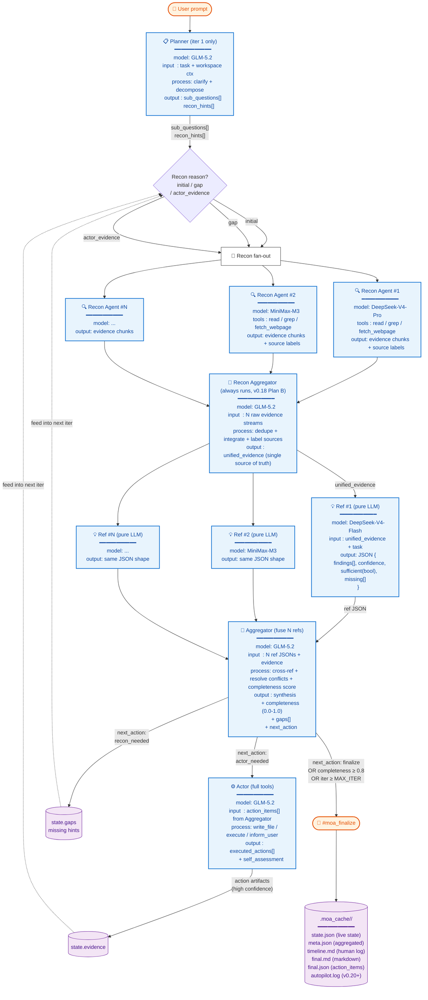

# vscode-moa

> 🌐 **Languages / 语言**: [English](./README.en.md) | **中文（当前 / Current）**

**面向 VSCode Copilot Chat 的混合专家智能体** — 通过原生 `vscode.lm` API 编排精简的 5 角色流水线（规划 → 侦察 → 参考 → 聚合 → 执行）。
>
> *English description: Mixture-of-Agents (MoA) for VSCode Copilot Chat — a streamlined 5-role pipeline that orchestrates multiple LLMs entirely through the native `vscode.lm` API. English users please see [README.en.md](./README.en.md) for the English version.*

[](./LICENSE)
[](https://code.visualstudio.com)
[](https://marketplace.visualstudio.com/items?itemName=dudali095.moa-bridge)
[](https://github.com/DDL095/vscode-moa/releases/latest)

## What it does / 它能做什么

`@moa <your question>` runs a multi-model fan-out directly in Copilot Chat. Three entry points, two loop shapes:

| Entry point | When to use | Loop shape |
|---|---|---|
| `@moa` (default) | Most cases — iterative refinement until Aggregator converges | Hermes loop, up to `MAX_ITER=12` |
| `@moaloop` | Same as `@moa` — explicit loop mode | Hermes loop |
| `@moasingle` | Fast single-shot — 1 iteration, forced finalize | No loop |
| `#moa_orchestrate` / `#moa_continue` / `#moa_finalize` | LM tools — drive the loop from another agent or chat | Hermes loop, disk-persisted state |
| `#moa_analyze` | LM tool — one-shot N refs + 1 aggregator, no loop | No loop |
| `#moa_recon` | LM tool — standalone read-only file collection | N/A |

### The 5-role pipeline (v0.15.0+, redesigned in v0.17–v0.18)

Each MoA iteration runs all 5 roles in sequence. The loop terminates when the Aggregator emits `finalize` (completeness ≥ 0.8) or hits `MAX_ITER=12`.



> **ℹ️ Rendering note**: GitHub and VSCode Marketplace render this diagram natively. **VSCode's built-in markdown preview does NOT support mermaid** — install the [Markdown Preview Mermaid Support](https://marketplace.visualstudio.com/items?itemName=bierner.markdown-mermaid) extension, or view this file on GitHub.

> **ℹ️ 渲染说明**：GitHub 和 VSCode Marketplace 原生支持 mermaid。**VSCode 自带的 markdown preview 不支持** —— 请安装 [Markdown Preview Mermaid Support](https://marketplace.visualstudio.com/items?itemName=bierner.markdown-mermaid) 扩展，或在 GitHub 上查看本文件。

**Single-model mode**: when `preset.reconModels` has only 1 entry (or `moa.parallelRecon: false`), the parallel fan-out collapses to a single Recon Agent. The Aggregator still runs — its job changes from "dedupe across models" to "normalize raw output + strip noise". Downstream Refs see the same shape either way (Plan B, see [CHANGELOG v0.18.0](./CHANGELOG.md#0180---2026-07-20)).

### Why parallel Recon?

Different LLMs exhibit different tool preferences under the same prompt:

- One model might lean on `fetch_webpage` for API docs; another prefers `grep_search` for symbol lookup
- One follows Planner's `recon_hints` literally; another deviates productively
- A rate-limit / 1213 from one model no longer tanks the phase — siblings compensate

Configure via `preset.reconModels` (array). See [Configuration](#configuration-reference) below.

### Closed-loop design (v0.15+)

The pipeline is fully closed-loop: Actor's artifacts feed back into `state.evidence` (high confidence), and Aggregator's `gaps` drive the next iteration's Recon. The Aggregator decides convergence — no hard thresholds on "what a good answer looks like", only on runaway protection:

- Hard `MAX_ITER=12` cap
- Convergence detection: 3 stalled iterations (completeness Δ < 0.05) → forced finalize
- Aggregator's `next_action` is the source of truth (`finalize` / `actor_needed` / `recon_needed`)

State persists to `<workspace>/.moa_cache/<task_id>/` so the loop survives main-session compaction. See [moaOrchestrator.ts](src/moaOrchestrator.ts) for the full state machine.

## Install

### Option A — from VSCode Marketplace (recommended)

1. Open the Extensions panel (`Ctrl+Shift+X`)
2. Search **"MoA Bridge"**
3. Click Install

Or command line:
```powershell
code --install-extension dudali095.moa-bridge
```

Marketplace page: https://marketplace.visualstudio.com/items?itemName=dudali095.moa-bridge

### Option B — from GitHub Release

1. Download the latest `moa-bridge-<version>.vsix` from the [releases page](https://github.com/DDL095/vscode-moa/releases).
2. `code --install-extension moa-bridge-<version>.vsix`
3. Reload VSCode.

### Option C — from source

```powershell
git clone https://github.com/DDL095/vscode-moa.git
cd vscode-moa
npm install
npm run compile      # dev bundle with source maps
# or: npm run package  # production bundle
code --extensionDevelopmentPath .
```

## First-run configuration

Run **`Moa: Configure Models`** from the command palette — an 8-step flow:

| Step | What | UI |
|---|---|---|
| 0/7 | Pick / create / delete a preset group *(v0.14.14)* | single-select |
| 1/7 | Reference advisors (2-8 models) | multi-select checkbox |
| 2/7 | Aggregator | single-select checkbox |
| 3/7 | Recon agent(s) — pick 1 for single-mode, 2+ for parallel, or "Use aggregator" for fallback *(v0.18.2: multi-select)* | multi-select checkbox |
| 4/7 | Recon Aggregator — integrates parallel Recon outputs; "Use main aggregator" is the recommended default *(v0.18.2)* | single-select checkbox |
| 5/7 | Planner — task decomposition for iter 1; "Use aggregator" is the recommended default *(v0.18.2)* | single-select checkbox |
| 6/7 | Actor — executes `action_items` with full tools; "Use aggregator" is the recommended default *(v0.18.2)* | single-select checkbox |
| 7/7 | L3 summarizer *(optional, default = disabled)* | single-select checkbox |

Every step except refs (Step 1) and recon (Step 3) offers a sentinel "Use aggregator" / "Disable" option as the first item — this is the recommended default for new presets, so users never see a concrete model pre-picked on first configuration. Pick a specific model only when you want to deviate from the aggregator.

Configuration is persisted to **both** User (Global) and Workspace tiers, so it works across windows without manual duplication.

### Preset groups (v0.14.14+)

A preset bundles the **entire pipeline config** into a named group. You can save multiple presets for different scenarios and switch between them with one click via **`Moa: Switch Preset`**.

```text
moa.presets = {
  "code":    { refModels: [...4 refs...], aggregator: {GLM-5.2},     reconModels: [DeepSeek, GLM],      reconAggregator: {GLM-5.2}, l3: {MiniMax-M3} },
  "research":{ refModels: [...6 refs...], aggregator: {MiniMax-M3},  reconModels: [DeepSeek, MiniMax], reconAggregator: {GLM-5.2}, l3: {disabled}   },
  "quick":   { refModels: [...2 refs...], aggregator: {GLM-5.2},     reconModel:  {DeepSeek},          l3: {disabled}   }
}
moa.activePreset = "code"   ← @moa uses this one
```

**Backward compatibility**: legacy flat config (`moa.refModels` + `moa.aggregator` + ...) is auto-migrated to `presets.default` on extension activation. Legacy fields are kept as read-only fallback.

## Usage

### As a chat participant (simplest)

```
@moa refactor src/moaRunner.ts to extract the sufficiency loop into its own module
@moa 多视角分析这个 PR 的设计权衡
@moa review the auth flow in src/services/auth/
```

### As VSCode LM tools (composable)

MoA registers five LM tools that any agent (Copilot Chat, other extensions, MCP servers) can invoke:

| Tool | Purpose |
|---|---|
| `moa_recon` | Standalone read-only file collection — returns structured Markdown summary of relevant files. |
| `moa_analyze` | One-shot MoA analysis — N refs + 1 aggregator in a single call. |
| `moa_orchestrate` | Start the iterative Hermes loop, returns `task_id` (supports `deferredResultId` for resume across compaction). |
| `moa_continue` | Advance the loop — optionally provide `reconResult` from a subagent to fill gaps. |
| `moa_finalize` | Terminate the loop — emits `action_items` + summary + unresolved gaps. |

Hermes-style subagent flow (recommended for complex tasks):

```
#moaRecon "gather everything related to the recon pipeline"
#moaAnalyze prompt="..." reconContext=<result from above>
```

Or drive the iterative loop manually:

```
#moaOrchestrate prompt="..." → returns task_id
#moaContinue task_id=<id> reconResult=<subagent output>
#moaFinalize task_id=<id> → action_items
```

## Pipeline visibility — 5 OutputChannels (v0.17.0+)

The full 5-role pipeline now writes intermediate output to **5 separate VSCode OutputChannels**, visible in `View → Output` dropdown (same level as `MoA Bridge Diag`):

| Channel | Contents |
|---|---|
| `MoA Planner` | Planner JSON output (iter 1 only) |
| `MoA Recon` | Per-recon-agent header + tool_calls count + elapsed + early_stop reason; ends with Recon Aggregator merged summary |
| `MoA Refs` | Each ref's raw LLM output (failed refs also logged) |
| `MoA Aggregator` | Aggregator raw + parsed JSON + finalizer output + iteration summary (completeness / next_action / convergence) |
| `MoA Actor` | Each action_item's status + artifacts + self_assessment |

Each channel includes iteration boundary headers (`═══════ iter N ═══════`) so users can scroll through multi-iteration runs without losing track. The chat response footer reminds you of these channels.

## Architecture

### 5 roles (v0.15.0+, redesigned v0.17–v0.18)

| Role | When | Purpose | Default model source | Tools? | UI step |
|---|---|---|---|---|---|
| **Planner** | iter 1 only | Clarify task; emit `sub_questions` + `recon_hints` | `preset.planner` (falls back to `moa.aggregator`) | None (pure reasoning) | Step 5/7 |
| **Recon** | every iter | Read files / grep / fetch URLs / list symbols; produce context summary | `preset.reconModels[]` (parallel) or `preset.reconModel` (single) | Read-only whitelist (24-pattern hard blacklist + 3-pattern soft blacklist) | Step 3/7 (multi-select) |
| **Recon Aggregator** | every iter (v0.18.0 Plan B) | Integrate N parallel Recon outputs; dedupe + label sources + verify cited files | `preset.reconAggregator` (falls back to `moa.aggregator`) | Full tools, prompt-constrained to verification only | Step 4/7 |
| **Refs** | every iter | N parallel LLM advisors; each emits `{sufficient, missing, analysis}` JSON | `moa.refModels` (multi-select) | None (pure reasoning) | Step 1/7 |
| **Aggregator** | every iter | Fuse ref outputs; emit `completeness` + `next_action` | `moa.aggregator` | None | Step 2/7 |
| **Actor** | on `actor_needed` | Execute `action_items` with full tool access; produce artifacts | `preset.actor` (falls back to `moa.aggregator`) | All `vscode.lm.tools` (filtered through read/write split) | Step 6/7 |
| **L3 Summarizer** | per large file in Recon | Digest single large file (>200K chars) to ~50K chars | `moa.l3Summarizer` (disabled by default) | None | Step 7/7 |

Every role with a "falls back to `moa.aggregator`" note offers a "Use aggregator" sentinel in its UI step — pick that unless you have a specific reason to deviate.

Layer toggles (any combination):

- `moa.enableRecon` (default `true`) — skip Phase 0 entirely
- `moa.enableActingAgent` (default `true`) — Aggregator output becomes the final answer when `false` (2-layer behavior)
- `moa.forceDirect` (default `false`) — bypass everything; Actor runs with just the user prompt + workspace context
- `moa.parallelRefs` (default `true`) — fan out Refs in parallel
- `moa.parallelRecon` (default `true`) — fan out Recon agents in parallel (requires `preset.reconModels.length ≥ 2`)

### Recon safeguards (v0.13.0+)

- **Tool blacklist**: 24 hard-blocked patterns (write/edit/delete/run/exec/terminal/git/…) + 3 soft-blocked (`run_in_terminal`, `get_terminal_output`, `exec`).
- **Early-stop**: stagnant (2 consecutive identical tool signatures) **or** saturated (<200 new chars per iteration for 2 iterations).
- **Max iterations**: 50 (hard cap 100). Most tasks converge in <15.
- **L3 grandchild agent**: when a single file exceeds `moa.reconL3Threshold` (default 200000 chars), a small model (default disabled; recommended MiniMax-M3) digests it to ~50k chars. Cached at `<workspace>/.moa_cache/l3_summaries/<sha1>.txt`. Set `moa.l3Summarizer.model = ""` to disable.
- **Path normalization** (v0.14.12+): relative paths emitted by LLMs are auto-resolved against the workspace root before tool dispatch; multi-workspace smart matching included.

### Local cache & workspace artifacts (v0.14.10+, updated v0.18.0)

MoA writes intermediate artifacts to `<workspace>/.moa_cache/`. These are **safe to delete** — MoA regenerates them on demand. The directory ships with an auto-generated `README.md` (template v2, written on first creation, never overwrites a user-edited copy) that documents every subdirectory, diagnostic flow, and cleanup strategy.

```mermaid
flowchart LR
    ROOT[.moa_cache/] --> R1[recon/&lt;task_sha&gt;/<br/>@moa end-to-end trace<br/>v0.14.3+]
    ROOT --> R2[l3_summaries/&lt;sha1&gt;.txt<br/>large-file digest cache<br/>v0.13.0+]
    ROOT --> R3[&lt;task_id&gt;/<br/>#moa_orchestrate state<br/>v0.12.0+]
    R3 --> S1[state.json<br/>atomic overwrite]
    R3 --> S2[timeline.md<br/>9-column iter view]
    R3 --> S3[final.md / final.json<br/>#moa_finalize output]
    R3 --> S4[iteration_NNN/<br/>per-iter artifacts]
    S4 --> I1[planner.json<br/>iter 1 only]
    S4 --> I2[recon_result.json<br/>Aggregator-merged<br/>v0.18.0: always written]
    S4 --> I3[recon/recon_N.json<br/>per parallel agent<br/>v0.18.0: parallel mode only]
    S4 --> I4[refs/&lt;label&gt;.json<br/>each ref raw output]
    S4 --> I5[aggregator.json<br/>completeness + next_action]
    S4 --> I6[actor_result.json<br/>actor_needed only]
    classDef root fill:#fff3e0,stroke:#e65100,stroke-width:2px,color:#bf360c
    classDef branch fill:#e8f4fd,stroke:#1976d2,stroke-width:1px,color:#0d47a1
    classDef leaf fill:#f1f8e9,stroke:#33691e,stroke-width:1px,color:#33691e
    class ROOT root
    class R1,R2,R3,S4 branch
    class S1,S2,S3,I1,I2,I3,I4,I5,I6 leaf
```

**Recommended `.gitignore` entry**:

```gitignore
# MoA Bridge cache (auto-generated by vscode-moa extension)
.moa_cache/
```

### Tokenizer

**None.** MoA has no tokenizer dependency — no `tiktoken`, no `js-tiktoken`, no `@vscode/*-tokenizer`. All budgets (`reconContextChars`, `reconL3Threshold`, `reconEarlyStopSaturated`, …) are **character-level approximations**. This keeps the bundle small (~270 KB vsix), avoids native bindings, and behaves consistently across Chinese / English / code. The trade-off is that "30k chars" is not "30k tokens" — for code-heavy prompts assume ~1.5-3× ratio.

## Relationship with GCMP

**MoA is vendor-agnostic** — it only calls `vscode.lm.selectChatModels({})` and uses whatever models VSCode exposes. It does not import, configure, or depend on [GCMP](https://marketplace.visualstudio.com/items?itemName=vicanent.gcmp) (or any other model-provider extension).

**But MoA is much more useful with GCMP installed.** The whole point of mixture-of-agents is *diverse* perspectives:

| Setup | Visible models | MoA behavior |
|---|---|---|
| Official Copilot only | GPT-5, Claude Sonnet, … (3-5) | Limited diversity — fan-out mostly hits same family |
| Official Copilot + **GCMP** | + DeepSeek-V4-Pro/Flash, GLM-5.2, MiniMax-M3, Qwen3, … (10-30+) | **True heterogeneous MoA** — different labs, different training data, different reasoning styles |

Recommended pairing:

| Role | Recommended vendor |
|---|---|
| Recon Agents (Phase 0) | DeepSeek-V4-Pro + MiniMax-M3 (different tool preferences) |
| Recon Aggregator | GLM-5.2 (CodingPlan) — strong fusion reasoning |
| Refs (Phase 1) | 3-4 models from different labs |
| Aggregator (Phase 2) | GLM-5.2 (CodingPlan) |
| L3 Summarizer | MiniMax-M3 (TokenPlan) — cheap, good at compression |

MoA is fully vendor-agnostic — there are **no hardcoded model IDs** in the codebase. Every layer reads its model from the `moa.*` configuration namespace; empty values disable the layer (or fall back to aggregator, in the case of `moa.reconModel`).

## Configuration reference

All settings live under the `moa.*` namespace. Edit via `settings.json` or use **`Moa: Configure Models`** for the 8-step guided flow.

### Models

| Key | Type | Default | Description |
|---|---|---|---|
| `moa.presets` | `Object<name, MoaPreset>` | `{}` | Named preset groups, each bundling refs + aggregator + recon + L3. Switch via **`Moa: Switch Preset`**. *(v0.14.14+; v0.18.0: `reconModels[]` + `reconAggregator` added to preset schema)* |
| `moa.activePreset` | string | `"default"` | Key into `moa.presets` for the currently active group. *(v0.14.14+)* |
| `moa.refModels` | `Array<{role, model}>` | `[]` | Reference advisors. `model` is matched as a substring against `LanguageModelChat.id`. *(legacy flat config; auto-migrated to `presets.default` on first use)* |
| `moa.aggregator` | `{model, temperature?}` | `{}` | Aggregator model (substring match). |
| `moa.reconModel` | `{model}` | `{model: ""}` | Single Recon model. Empty = reuse aggregator. *(For parallel multi-model Recon, use `preset.reconModels[]` instead — v0.18.0)* |
| `moa.l3Summarizer` | `{model}` | `{model: ""}` | L3 grandchild model. Empty = disable L3. |

### Pipeline behavior

| Key | Type | Default | Description |
|---|---|---|---|
| `moa.parallelRefs` | boolean | `true` | Fan out refs in parallel (`Promise.allSettled`) — wall-clock = slowest ref. Set `false` for sequential fan-out if your provider rate-limits concurrent requests. *(v0.14.14: default flipped from `false` to `true`)* |
| `moa.parallelRecon` | boolean | `true` | Fan out Recon agents in parallel when `preset.reconModels` has 2+ models. When `false`, or when only 1 recon model is configured, runs sequentially. *(v0.18.0)* |
| `moa.sharedRefPrompt` | string | `""` | Override the shared ref system prompt. Empty = built-in Hermes prompt. |
| `moa.refDisplayMode` | `"thinking"` \| `"verbose"` | `"thinking"` | ⚠️ **Keep `thinking` (default, STRONGLY RECOMMENDED)**. `thinking` keeps refs out of chat history (Hermes-style — refs go to 'MoA Bridge — Ref Output' panel, aggregator reads in-memory JSON only). `verbose` streams refs inline as markdown AND records them to chat history — ⚠️ **context pollution risk**: thousands of tokens × N refs × M iterations accumulate in Copilot context, slowing follow-ups and potentially confusing the aggregator. Use `verbose` only if you explicitly need Copilot follow-ups to reference individual ref opinions. |
| `moa.enableRecon` | boolean | `true` | Toggle Phase 0. |
| `moa.enableActingAgent` | boolean | `true` | Toggle Phase 3. |
| `moa.forceDirect` | boolean | `false` | ⚠️ **WARNING — bypasses multi-model safety net.** Skip the whole pipeline — direct acting agent. Loses: (1) cross-model verification, (2) recon-collected evidence, (3) aggregator synthesis. Use ONLY after repeated multi-model failures. |
| `moa.maxReconRounds` | number (1-20) | `3` | Sufficiency-loop cap. v0.20.1 raised hard cap from 5 → 10; v0.20.2 raised further to 20 for deep research. |

### Recon tuning (v0.13.0+)

| Key | Default | Description |
|---|---|---|
| `moa.maxReconIterations` | `50` | Hard cap on tool calls per recon task. v0.20.1 raised max from 100 → 200; v0.20.2 raised further to 500 for very large monorepos / deep research. |
| `moa.reconContextChars` | `500000` | **[DEPRECATED v0.14.5]** No longer enforces a cap; only recorded to `meta.json` as an audit metric. Original v0.13.0 role (character budget truncation) was removed because refs are single-turn history-less and 1M-context models can digest any size — if recon truly overflows, that's a search-direction problem for the LLM to handle, not a truncation problem. Kept for backward compat. |
| `moa.reconAllowTerminal` | `false` | Allow terminal tools in recon (off by default for safety). |
| `moa.reconEarlyStopStagnant` | `2` (max 50) | Stop after N consecutive identical tool signatures. v0.20.2 raised max from 10 → 50. |
| `moa.reconEarlyStopSaturated` | `200` (max 50000) | Stop after N iterations adding <200 chars each (post-iter-5). v0.20.2 raised max from 5000 → 50000. |
| `moa.reconL3Threshold` | `200000` (min 10000) | Single-file size (chars) that triggers L3 summarization. v0.14.4 raised from 60k → 200k — modern 1M-context models rarely need L3; only truly huge files (generated schemas, minified bundles) trigger it. v0.20.2 lowered minimum from 50000 → 10000 for more aggressive triggering. |
| `moa.reconL3MaxCalls` | `5` (max 100) | Max L3 grandchild calls per MoA task. `0` disables. v0.20.2 raised max from 20 → 100. |
| `moa.reconL3TargetChars` | `50000` (max 500000) | L3 target output length (chars). v0.14.4 raised from 10k → 50k to avoid over-compression. v0.20.2 added maximum=500000 cap. |

### Actor execution control (v0.20.0+)

The Actor role (Phase 5) actually *executes* the Aggregator's `action_items` — it can write files, run terminal commands, and produce side effects. v0.20.0 introduces a layered control system to gate this power.

**At a glance — the 4+1 `executionPreset` modes**:

| Preset | Auto-execute after finalize? | Approval popups | Backup `.bak.<ts>` | Use case |
|---|---|---|---|---|
| `manual` (default) | ❌ returns markdown; user calls `#moa_execute` | `batch` (Gate-A QuickPick) | ✅ | First-time use, exploratory tasks |
| `supervised` | ✅ | `batch` (Gate-A QuickPick multi-select per round) | ✅ | Trusted but human-monitored workflows |
| `autopilot` | ✅ | `none` (zero human-in-the-loop) | ✅ (only safety net) | Trusted CI / repeated retry pipelines |
| `yolo` | ✅ | `none` | ❌ (irreversible) | Sandboxed / throwaway runs |
| `custom` | controlled by `autoExecuteAfterFinalize` | controlled by `approvalMode` | controlled by `safeExecutionMode` | Manual fine-grained control |

**Execution flow under each preset**:

```
finalize completes
   │
   ├─ manual:        return markdown → user/main session calls #moa_execute → Gate-A QuickPick → execute
   ├─ supervised:    auto-call Actor → Gate-A QuickPick multi-select → execute (safeMode on)
   ├─ autopilot:     auto-call Actor → execute immediately (safeMode on, no popups)
   ├─ yolo:          auto-call Actor → execute immediately (safeMode off, no popups, no backup)
   └─ custom:        behavior driven by 3 fine-grained configs below
```

**The 3 fine-grained configs** (only effective when `executionPreset='custom'`; otherwise preset overrides):

| Key | Type | Default | Description |
|---|---|---|---|
| `moa.autoExecuteAfterFinalize` | boolean | `false` | When `true`, `finalizeTask()` auto-invokes Actor. When `false`, returns markdown for manual `#moa_execute`. |
| `moa.approvalMode` | `none` \| `batch` \| `per_call` \| `batch_plus_per_call` | `batch` | Approval gate before destructive tool calls. `batch` = Gate-A QuickPick at Actor entry; `per_call` = Gate-B Yes/No dialog before each destructive call; `batch_plus_per_call` = both gates. |
| `moa.safeExecutionMode` | boolean | `true` | When `true`, SafeExecutor backs up every `write_file` to `<target>.bak.<timestamp>` and records all actions to `manifest.json`. When `false`, no backup (irreversible). |

**Approval gates — two flavors**:

- **Gate-A (batch)**: QuickPick multi-select dialog at the entry of each Actor call. Lists all `action_items` with type + target + rationale. User can deselect unwanted items. Rejected items are recorded as `status: rejected_by_user` in `manifest.json` for auditability.
- **Gate-B (per-call)**: Yes/No/Yes to All/Reject All dialog before each destructive tool call (`write_file` / `delete` / `execute`). `Yes to All` skips subsequent Gate-B prompts in the same task. `Reject All` throws `ApprovalRejectedError` and aborts the Actor.

**Auditing & recovery**:

- Every side-effecting action (in any preset) is logged to `.moa_cache/<task_id>/manifest.json` with `iter` / `seq` / `type` / `target` / `tool_name` / `input_summary` / `status` / `backup_path` / `output_chars` / `timestamp`.
- Backups go to `<target>.bak.<timestamp>` next to the original file. To roll back, delete the new file and rename `.bak.<ts>` back.
- `autopilot.log` (v0.20.0) in the task dir is a human-readable summary: `started_at` / `elapsed_sec` / `tool_calls` / per-action status. Useful for CI logs.

**Recommended preset for each scenario**:

| Scenario | Recommended preset | Reason |
|---|---|---|
| First-time user trying MoA | `manual` | See what the pipeline produces before executing |
| Daily coding assistant (you watch the screen) | `supervised` | Auto-execute + visual approval |
| Nightly batch / CI pipeline | `autopilot` | Zero human-in-the-loop, backup is the safety net |
| Sandboxed experiment (VM / container) | `yolo` | Fast iteration, no backup overhead |
| Need to mix-and-match behaviors | `custom` | Independent control of the 3 axes |

---

### Actor 执行控制（中文版）

Actor 角色（Phase 5）会**真正执行** Aggregator 给出的 `action_items` —— 可能写文件、跑终端命令、产生副作用。v0.20.0 引入分层控制系统来门控这种权力。

**速查表 —— 4+1 个 `executionPreset` 模式**：

| Preset | finalize 后自动执行？ | 审批弹窗 | `.bak.<ts>` 备份 | 适用场景 |
|---|---|---|---|---|
| `manual`（默认） | ❌ 只返回 markdown，需用户/主会话显式调用 `#moa_execute` | `batch`（Gate-A QuickPick） | ✅ | 首次使用、探索性任务 |
| `supervised` | ✅ | `batch`（每轮 Gate-A QuickPick 多选） | ✅ | 有人值守的常规任务 |
| `autopilot` | ✅ | `none`（零人工介入） | ✅（唯一安全网） | 可信 CI / 重试流水线 |
| `yolo` | ✅ | `none` | ❌（不可逆） | 沙盒 / 一次性运行 |
| `custom` | 由 `autoExecuteAfterFinalize` 控制 | 由 `approvalMode` 控制 | 由 `safeExecutionMode` 控制 | 手动细粒度控制 |

**3 个细粒度配置**（仅在 `executionPreset='custom'` 时生效；其他 preset 会覆盖）：

| Key | 类型 | 默认值 | 说明 |
|---|---|---|---|
| `moa.autoExecuteAfterFinalize` | boolean | `false` | `true` = `finalizeTask()` 自动调用 Actor；`false` = 只返回 markdown，需手动 `#moa_execute`。 |
| `moa.approvalMode` | `none` \| `batch` \| `per_call` \| `batch_plus_per_call` | `batch` | 破坏性工具调用前的审批门。`batch` = Gate-A 入口 QuickPick；`per_call` = Gate-B 每次破坏性调用前 Yes/No 对话框；`batch_plus_per_call` = 双门。 |
| `moa.safeExecutionMode` | boolean | `true` | `true` = SafeExecutor 把每个 `write_file` 备份到 `<目标>.bak.<时间戳>`，所有操作记录到 `manifest.json`。`false` = 无备份（不可逆）。 |

**审批门 —— 两种风格**：

- **Gate-A（批量）**：每次 Actor 调用入口弹 QuickPick 多选框，列出所有 `action_items`（type + target + rationale），用户可反选不想要的项。被拒绝的项以 `status: rejected_by_user` 记入 `manifest.json` 以便审计。
- **Gate-B（逐次）**：每个破坏性工具调用前（`write_file` / `delete` / `execute`）弹 Yes/No/Yes to All/Reject All 对话框。`Yes to All` 在本任务内跳过后续 Gate-B 提示；`Reject All` 抛 `ApprovalRejectedError` 并中止 Actor。

**审计与回滚**：

- 任何 preset 下的每个副作用操作都被记录到 `.moa_cache/<task_id>/manifest.json`，字段含 `iter` / `seq` / `type` / `target` / `tool_name` / `input_summary` / `status` / `backup_path` / `output_chars` / `timestamp`。
- 备份写入 `<target>.bak.<timestamp>`（原文件旁边）。要回滚：删新文件，把 `.bak.<ts>` 改回原名即可。
- 任务目录里的 `autopilot.log`（v0.20.0）是人类可读摘要：`started_at` / `elapsed_sec` / `tool_calls` / 每个 action 的 status。适合 CI 日志。

### Cache & lifecycle (v0.19.1+, revised v0.20.2)

| Key | Default | Description |
|---|---|---|
| `moa.cacheTtlDays` | `30` | Tasks older than this TTL (in days) will be cleaned up when running the `MoA: Cleanup Old Tasks` command. **v0.20.2: Set to 0 to disable TTL cleanup entirely** (tasks are never auto-deleted; you must manually remove `.moa_cache/`). Maximum raised from 365 to 36500 (~100 years) for long-term archival. |
| `moa.cacheRootDir` | `""` (empty) | Override the cache root directory. Default empty (uses `<workspaceFolder>/.moa_cache/`). Set to an absolute path to centralize all MoA task caches across workspaces. |

**Common patterns**:
- **Default (30 days)**: suitable for most users; stale experiments auto-cleaned monthly.
- **`0` (never delete)**: for long-running research projects where you want to audit every task months later.
- **`365` (1 year)**: balance between retention and disk usage.
- **Custom `cacheRootDir`**: set to e.g. `D:/moa_cache` to share cache across multiple workspaces (useful for CI).

## File layout

```
vscode-moa/
├── package.json                # manifest, chatParticipants, languageModelTools, configuration
├── src/
│   ├── extension.ts            # activate() — registers @moa + LM tools + commands
│   ├── moaHandler.ts           # ChatRequestHandler — dispatches @moa / @moaloop / @moasingle
│   ├── moaRunner.ts            # single-shot @moa pipeline (recon → refs → aggregator → acting)
│   ├── moaConfig.ts            # Configure Models 8-step flow + switchPreset + singlePickWithCheckbox
│   ├── presetConfig.ts         # Preset group management (incl. resolveReconModels — v0.18.0)
│   ├── actingAgent.ts          # Phase 3 tool-calling agent + read-only tool filter + runReconAgent
│   ├── workspaceContext.ts     # active editor / open docs / project tree snapshot
│   ├── l3Summarizer.ts         # L3 grandchild agent (large-file digest) + cache
│   ├── cacheReadme.ts          # auto-write `.moa_cache/README.md` (template v2 — v0.18.0)
│   ├── moaReconTool.ts         # moa_recon LM tool impl
│   ├── moaTool.ts              # moa_analyze LM tool impl
│   ├── moaOrchestrator.ts      # iterative MoA loop state machine (5-role)
│   ├── moaOrchestrateTools.ts  # moa_orchestrate / continue / finalize LM tools
│   ├── pipelineChannels.ts     # 5 OutputChannels + logPipeline helpers (v0.17.0)
│   ├── probeTools.ts           # debug command — list vscode.lm.tools
│   ├── moaCore/
│   │   ├── roles.ts            # buildPlannerPrompt / buildReconPrompt / buildRefPrompt / buildAggregatorPrompt / buildFinalPrompt
│   │   ├── runRecon.ts         # callRecon Plan B pipeline + parallel models + Recon Aggregator (v0.18.0)
│   │   ├── actorEvidence.ts    # buildActorEvidence pure helper (v0.15.1)
│   │   └── ...
│   └── types.ts                # shared TS types (MoaPreset.reconModels/reconAggregator — v0.18.0)
├── CHANGELOG.md
└── README.md
```

## Debugging

- **`Moa: Probe Available Tools`** — lists every tool registered in `vscode.lm.tools`. Use this to verify Copilot / other extensions are exposing the tools MoA's acting agent can call.
- **5 OutputChannels** (`View → Output` dropdown) — per-role visibility into Planner / Recon / Refs / Aggregator / Actor output, with iteration boundary headers.
- Set `"moa.refDisplayMode": "verbose"` to see raw ref outputs inline (useful when debugging aggregator fusion issues).
- **End-to-end audit**: every `@moa` invocation writes a complete trace to `<workspace>/.moa_cache/recon/<task_sha>/`; every `#moa_orchestrate` iteration writes to `<workspace>/.moa_cache/<task_id>/iteration_NNN/`. The auto-generated `.moa_cache/README.md` (template v2) has dedicated diagnostic sections for both.

## Build & release

```powershell
npm install
npm run compile          # dev bundle
npm run package          # production bundle
npx vsce package         # build .vsix
```

Releases are published to [GitHub Releases](https://github.com/DDL095/vscode-moa/releases) — each release has the corresponding `.vsix` attached.

## License

MIT — see [LICENSE](./LICENSE).
