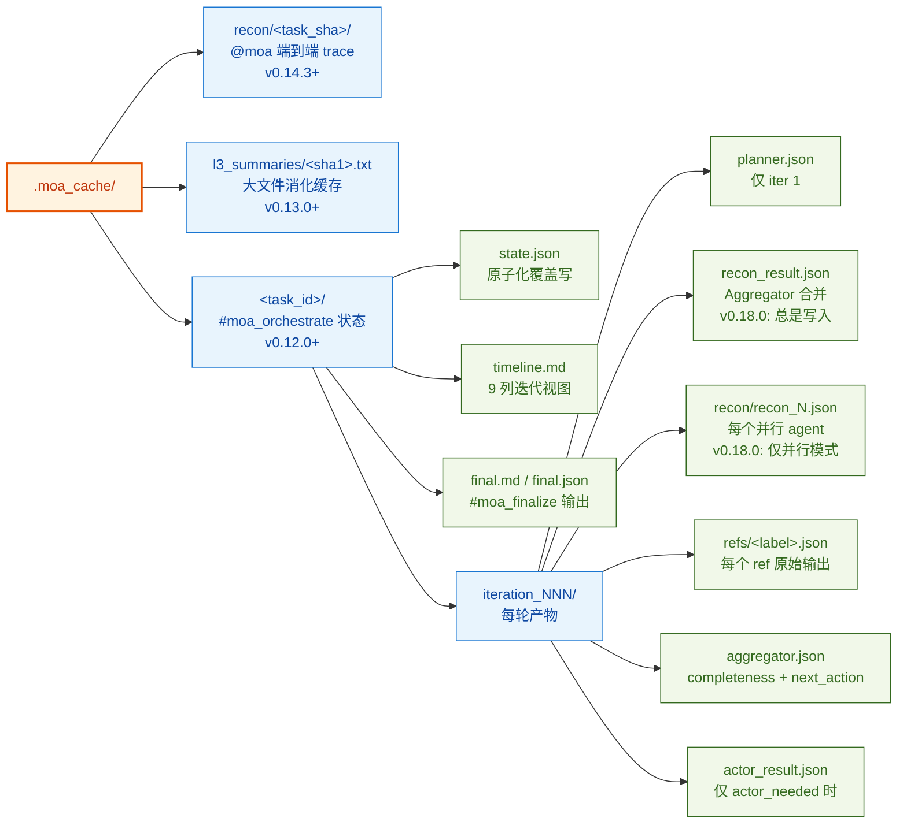

# vscode-moa

> 🌐 **Languages / 语言**: [English](./README.en.md) | **中文（当前 / Current）**

**面向 VSCode Copilot Chat 的混合专家智能体** — 通过原生 `vscode.lm` API 编排精简的 5 角色流水线（规划 → 侦察 → 参考 → 聚合 → 执行）。
>
> *English description: Mixture-of-Agents (MoA) for VSCode Copilot Chat — a streamlined 5-role pipeline that orchestrates multiple LLMs entirely through the native `vscode.lm` API. English users please see [README.en.md](./README.en.md) for the English version.*

[](./LICENSE)
[](https://code.visualstudio.com)
[](https://marketplace.visualstudio.com/items?itemName=dudali095.moa-bridge)
[](https://github.com/DDL095/vscode-moa/releases/latest)

## What it does / 它能做什么

`@moa <your question>` 在 Copilot Chat 中直接运行多模型扇出。三种入口，两种 loop 形态：

| 入口 | 使用场景 | Loop 形态 |
|---|---|---|
| `@moa`（默认） | 多数场景 —— 迭代优化直到 Aggregator 收敛 | Hermes loop，最多 `MAX_ITER=12` 轮 |
| `@moaloop` | 同 `@moa` —— 显式 loop 模式 | Hermes loop |
| `@moasingle` | 快速单次 —— 1 轮迭代，强制 finalize | 无 loop |
| `#moa_orchestrate` / `#moa_continue` / `#moa_finalize` | LM 工具 —— 从另一个 agent 或 chat 驱动 loop | Hermes loop，状态落盘 |
| `#moa_analyze` | LM 工具 —— 单次 N refs + 1 aggregator，无 loop | 无 loop |
| `#moa_recon` | LM 工具 —— 独立只读文件收集 | N/A |

### The 5-role pipeline (v0.15.0+, redesigned in v0.17–v0.18)

Each MoA iteration runs all 5 roles in sequence. The loop terminates when the Aggregator emits `finalize` (completeness ≥ 0.8) or hits `MAX_ITER=12`.


> **ℹ️ Rendering note**: GitHub and VSCode Marketplace render this diagram natively. **VSCode's built-in markdown preview does NOT support mermaid** — install the [Markdown Preview Mermaid Support](https://marketplace.visualstudio.com/items?itemName=bierner.markdown-mermaid) extension, or view this file on GitHub.

> **ℹ️ 渲染说明**：GitHub 和 VSCode Marketplace 原生支持 mermaid。**VSCode 自带的 markdown preview 不支持** —— 请安装 [Markdown Preview Mermaid Support](https://marketplace.visualstudio.com/items?itemName=bierner.markdown-mermaid) 扩展，或在 GitHub 上查看本文件。

**单模型模式 / Single-model mode**：当 `preset.reconModels` 只有 1 项（或 `moa.parallelRecon: false`）时，并行扇出塌缩为单个 Recon Agent。Aggregator 仍会运行 —— 职责从"跨模型去重"变为"规范化原始输出 + 剔除噪声"。下游 Refs 看到的形状不变（Plan B，见 [CHANGELOG v0.18.0](./CHANGELOG.md#0180---2026-07-20)）。

### 为什么需要并行 Recon？/ Why parallel Recon?

不同 LLM 在同一个 prompt 下表现出不同的工具偏好：

- 一个模型可能偏向用 `fetch_webpage` 查 API 文档；另一个偏好用 `grep_search` 查符号
- 一个严格遵循 Planner 的 `recon_hints`；另一个会做有益的偏离
- 某个模型遇到 rate-limit / 1213 不会再拖垮整个 phase —— 兄弟模型会补偿

通过 `preset.reconModels`（数组）配置。见下方 [Configuration](#configuration-reference)。

### Closed-loop design (v0.15+)

流水线是完全闭环的：Actor 的 artifacts 反馈到 `state.evidence`（高置信度），Aggregator 的 `gaps` 驱动下一轮 Recon。Aggregator 决定收敛 —— 不对"好答案长什么样"设硬阈值，只做失控保护：

- 硬性 `MAX_ITER=12` 上限
- 收敛检测：连续 3 轮停滞（completeness Δ < 0.05）→ 强制 finalize
- Aggregator 的 `next_action` 是真相源（`finalize` / `actor_needed` / `recon_needed`）

状态持久化到 `<workspace>/.moa_cache/<task_id>/`，让 loop 能挺过主会话 compact。完整状态机见 [moaOrchestrator.ts](src/moaOrchestrator.ts)。

## 安装 / Install

### 方式 A — 从 VSCode Marketplace 安装（推荐）

1. 打开扩展面板（`Ctrl+Shift+X`）
2. 搜索 **"MoA Bridge"**
3. 点击 Install

或命令行：
```powershell
code --install-extension dudali095.moa-bridge
```

Marketplace 页面：https://marketplace.visualstudio.com/items?itemName=dudali095.moa-bridge

### 方式 B — 从 GitHub Release 安装

1. 从 [releases 页面](https://github.com/DDL095/vscode-moa/releases) 下载最新的 `moa-bridge-<version>.vsix`。
2. `code --install-extension moa-bridge-<version>.vsix`
3. 重载 VSCode。

### 方式 C — 从源码构建

```powershell
git clone https://github.com/DDL095/vscode-moa.git
cd vscode-moa
npm install
npm run compile      # 开发 bundle，含 source map
# 或：npm run package  # 生产 bundle
code --extensionDevelopmentPath .
```

## 首次配置 / First-run configuration

从命令面板运行 **`Moa: Configure Models`** —— 8 步引导式配置：

| 步骤 | 配置内容 | UI |
|---|---|---|
| 0/7 | 选择 / 创建 / 删除一个 preset 组 *(v0.14.14)* | 单选 |
| 1/7 | 参考顾问（2-8 个模型） | 多选复选框 |
| 2/7 | 聚合器 | 单选复选框 |
| 3/7 | Recon 代理 —— 选 1 个为单模式，选 2+ 个为并行，或选 "Use aggregator" fallback *(v0.18.2: 多选)* | 多选复选框 |
| 4/7 | Recon 聚合器 —— 整合并行 Recon 输出；推荐默认 "Use main aggregator" *(v0.18.2)* | 单选复选框 |
| 5/7 | Planner —— iter 1 的任务分解；推荐默认 "Use aggregator" *(v0.18.2)* | 单选复选框 |
| 6/7 | Actor —— 用完整工具执行 `action_items`；推荐默认 "Use aggregator" *(v0.18.2)* | 单选复选框 |
| 7/7 | L3 摘要器 *(可选，默认禁用)* | 单选复选框 |

除 refs（Step 1）和 recon（Step 3）外，每步都提供哨兵选项 "Use aggregator" / "Disable" 作为第一项 —— 这是新 preset 的推荐默认值，用户首次配置时不会看到具体模型被预先选中。只有想偏离 aggregator 时才选具体模型。

配置会同时持久化到 **User（Global）和 Workspace** 两级，跨窗口无需手动同步。

### Preset 组 / Preset groups (v0.14.14+)

一个 preset 把**整个流水线配置**打包到一个命名组里。你可以为不同场景保存多个 preset，通过 **`Moa: Switch Preset`** 一键切换。

```text
moa.presets = {
  "code":    { refModels: [...4 refs...], aggregator: {GLM-5.2},     reconModels: [DeepSeek, GLM],      reconAggregator: {GLM-5.2}, l3: {MiniMax-M3} },
  "research":{ refModels: [...6 refs...], aggregator: {MiniMax-M3},  reconModels: [DeepSeek, MiniMax], reconAggregator: {GLM-5.2}, l3: {disabled}   },
  "quick":   { refModels: [...2 refs...], aggregator: {GLM-5.2},     reconModel:  {DeepSeek},          l3: {disabled}   }
}
moa.activePreset = "code"   ← @moa 使用这个
```

**向后兼容**：旧的扁平配置（`moa.refModels` + `moa.aggregator` + ...）会在扩展激活时自动迁移到 `presets.default`。旧字段作为只读 fallback 保留。

## 用法 / Usage

### 作为 chat 参与者（最简单）

```
@moa refactor src/moaRunner.ts to extract the sufficiency loop into its own module
@moa 多视角分析这个 PR 的设计权衡
@moa review the auth flow in src/services/auth/
```

### 作为 VSCode LM 工具（可组合）

MoA 注册了 6 个 LM 工具，任何 agent（Copilot Chat、其他扩展、MCP server）都可以调用：

| 工具 | 用途 |
|---|---|
| `moa_recon` | 独立只读文件收集 —— 返回相关文件的结构化 Markdown 摘要。 |
| `moa_analyze` | 单次 MoA 分析 —— N 个 refs + 1 个 aggregator 一次调用完成。 |
| `moa_orchestrate` | 启动迭代 Hermes loop，返回 `task_id`（支持 `deferredResultId` 跨 compact 恢复）。 |
| `moa_continue` | 推进 loop —— 可选提供来自 subagent 的 `reconResult` 来填补缺口。 |
| `moa_finalize` | 终止 loop —— 产出 `action_items` + summary + 未解决缺口。 |
| `moa_execute` *(v0.20.0+)* | 执行 finalized 的 `action_items`，受审批门约束。`autopilot` 模式下自动跳过（finalize 后已自动执行）。 |

Hermes 风格 subagent 流（复杂任务推荐）：

```
#moaRecon "gather everything related to the recon pipeline"
#moaAnalyze prompt="..." reconContext=<result from above>
```

或手动驱动迭代 loop：

```
#moaOrchestrate prompt="..." → 返回 task_id
#moaContinue task_id=<id> reconResult=<subagent output>
#moaFinalize task_id=<id> → action_items
```

## 流水线可视化 —— 5 个 OutputChannel / Pipeline visibility (v0.17.0+)

完整的 5 角色流水线现在会把中间输出写到 **5 个独立的 VSCode OutputChannel**，在 `View → Output` 下拉框可见（与 `MoA Bridge Diag` 同级）：

| Channel | 内容 |
|---|---|
| `MoA Planner` | Planner JSON 输出（仅 iter 1） |
| `MoA Recon` | 每个 recon agent 的 header + tool_calls 数 + 耗时 + early_stop 原因；末尾是 Recon Aggregator 合并摘要 |
| `MoA Refs` | 每个 ref 的原始 LLM 输出（失败的 ref 也会记录） |
| `MoA Aggregator` | Aggregator 原始输出 + 解析后 JSON + finalizer 输出 + 迭代摘要（completeness / next_action / convergence） |
| `MoA Actor` | 每个 action_item 的 status + artifacts + self_assessment |

每个 channel 都有迭代边界 header（`═══════ iter N ═══════`），方便多迭代运行时滚动查看不丢失上下文。chat 响应末尾会提醒这些 channel。

## 架构 / Architecture

### 5 个角色 / 5 roles (v0.15.0+, v0.17–v0.18 重设计)

| 角色 | 运行时机 | 用途 | 默认模型来源 | 工具？ | UI 步骤 |
|---|---|---|---|---|---|
| **Planner** | 仅 iter 1 | 澄清任务；产出 `sub_questions` + `recon_hints` | `preset.planner`（fallback 到 `moa.aggregator`） | 无（纯推理） | Step 5/7 |
| **Recon** | 每 iter | 读文件 / grep / fetch URL / 列符号；产出上下文摘要 | `preset.reconModels[]`（并行）或 `preset.reconModel`（单模型） | 只读白名单（24 模式硬黑名单 + 3 模式软黑名单） | Step 3/7（多选） |
| **Recon Aggregator** | 每 iter（v0.18.0 Plan B） | 整合 N 个并行 Recon 输出；去重 + 标注来源 + 验证引用文件 | `preset.reconAggregator`（fallback 到 `moa.aggregator`） | 全工具，prompt 约束为仅验证 | Step 4/7 |
| **Refs** | 每 iter | N 个并行 LLM 顾问；每个产出 `{sufficient, missing, analysis}` JSON | `moa.refModels`（多选） | 无（纯推理） | Step 1/7 |
| **Aggregator** | 每 iter | 融合 ref 输出；产出 `completeness` + `next_action` | `moa.aggregator` | 无 | Step 2/7 |
| **Actor** | 触发于 `actor_needed` | 用完整工具权限执行 `action_items`；产出 artifacts | `preset.actor`（fallback 到 `moa.aggregator`） | 所有 `vscode.lm.tools`（按读/写分离过滤） | Step 6/7 |
| **L3 Summarizer** | Recon 中遇到大文件时 | 把单个大文件（>200K 字符）消化到 ~50K 字符 | `moa.l3Summarizer`（默认禁用） | 无 | Step 7/7 |

每个标注 "falls back to `moa.aggregator`" 的角色在 UI 步骤中都提供 "Use aggregator" 哨兵选项 —— 除非有特殊原因要偏离，否则选这个。

层级开关（任意组合）：

- `moa.enableRecon`（默认 `true`）—— 完全跳过 Phase 0
- `moa.enableActingAgent`（默认 `true`）—— `false` 时 Aggregator 输出即最终答案（2 层行为）
- `moa.forceDirect`（默认 `false`）—— 绕过一切；Actor 只拿用户 prompt + workspace 上下文直接跑
- `moa.parallelRefs`（默认 `true`）—— 并行扇出 Refs
- `moa.parallelRecon`（默认 `true`）—— 并行扇出 Recon agent（需要 `preset.reconModels.length ≥ 2`）

### Recon 防护 / Recon safeguards (v0.13.0+)

- **工具黑名单**：24 个硬阻断模式（write/edit/delete/run/exec/terminal/git/…）+ 3 个软阻断（`run_in_terminal`、`get_terminal_output`、`exec`）。
- **早停**：stagnant（连续 2 次工具签名完全相同）**或** saturated（连续 2 次迭代新增 <200 字符）。
- **最大迭代数**：50（硬上限 100，v0.20.2 提到 500）。多数任务 <15 就收敛。
- **L3 孙代理**：单个文件超过 `moa.reconL3Threshold`（默认 200000 字符）时，派一个小模型（默认禁用；推荐 MiniMax-M3）把它消化到 ~50k 字符。缓存在 `<workspace>/.moa_cache/l3_summaries/<sha1>.txt`。设 `moa.l3Summarizer.model = ""` 禁用。
- **路径规范化**（v0.14.12+）：LLM 输出的相对路径会在工具派发前自动按 workspace root 解析；含多 workspace 智能匹配。

### 本地缓存与工作区产物 / Local cache & workspace artifacts (v0.14.10+, v0.18.0 更新)

MoA 把中间产物写到 `<workspace>/.moa_cache/`。这些文件**可以安全删除** —— MoA 会按需重新生成。该目录会自动生成一份 `README.md`（template v2，首次创建时写入，永不覆盖用户编辑过的副本），文档化每个子目录、诊断流程和清理策略。



**推荐的 `.gitignore` 条目**：

```gitignore
# MoA Bridge cache（vscode-moa 扩展自动生成）
.moa_cache/
```

### Tokenizer

**无。** MoA 不依赖任何 tokenizer —— 没有 `tiktoken`、没有 `js-tiktoken`、没有 `@vscode/*-tokenizer`。所有预算（`reconContextChars`、`reconL3Threshold`、`reconEarlyStopSaturated` 等）都是**字符级近似**。好处：bundle 小（~370 KB vsix）、无需 native binding、中英文/代码行为一致。代价："30k 字符" ≠ "30k tokens" —— 代码密集型 prompt 假设 ~1.5-3× 比率。

## 与 GCMP 的关系 / Relationship with GCMP

**MoA 是 vendor-agnostic 的** —— 它只调用 `vscode.lm.selectChatModels({})`，使用 VSCode 暴露的任何模型。它不 import、配置或依赖 [GCMP](https://marketplace.visualstudio.com/items?itemName=vicanent.gcmp)（或任何其他 model-provider 扩展）。

**但 MoA 装了 GCMP 会更有用。** Mixture-of-agents 的全部意义就是*异构*视角：

| 配置 | 可见模型 | MoA 行为 |
|---|---|---|
| 仅官方 Copilot | GPT-5、Claude Sonnet 等（3-5 个） | 多样性有限 —— 扇出基本撞同一家族 |
| 官方 Copilot + **GCMP** | + DeepSeek-V4-Pro/Flash、GLM-5.2、MiniMax-M3、Qwen3 等（10-30+ 个） | **真正的异构 MoA** —— 不同实验室、不同训练数据、不同推理风格 |

推荐搭配：

| 角色 | 推荐厂商 |
|---|---|
| Recon Agent（Phase 0） | DeepSeek-V4-Pro + MiniMax-M3（工具偏好不同） |
| Recon Aggregator | GLM-5.2 (CodingPlan) —— 强融合推理 |
| Refs（Phase 1） | 3-4 个来自不同实验室的模型 |
| Aggregator（Phase 2） | GLM-5.2 (CodingPlan) |
| L3 Summarizer | MiniMax-M3 (TokenPlan) —— 便宜、擅长压缩 |

MoA 完全 vendor-agnostic —— 代码中**没有硬编码任何 model ID**。每一层从 `moa.*` 配置命名空间读取模型；空值禁用该层（或 fallback 到 aggregator，如 `moa.reconModel`）。

## 配置参考 / Configuration reference

所有配置都在 `moa.*` 命名空间下。通过 `settings.json` 编辑，或用 **`Moa: Configure Models`** 8 步引导流程。

> 📖 配置项的 VSCode 设置 UI 描述已在 v0.20.2+ 全部双语化（中文 + 英文）。本节给出表格化的完整参考。

### Models / 模型

| Key | Type | Default | Description |
|---|---|---|---|
| `moa.presets` | `Object<name, MoaPreset>` | `{}` | 命名预设组，每个打包 refs + aggregator + recon + L3。通过 **`Moa: Switch Preset`** 切换。*(v0.14.14+；v0.18.0: preset schema 新增 `reconModels[]` + `reconAggregator`)* |
| `moa.activePreset` | string | `"default"` | `moa.presets` 中当前激活组的 key。*(v0.14.14+)* |
| `moa.refModels` | `Array<{role, model}>` | `[]` | 参考顾问。`model` 作为子串匹配 `LanguageModelChat.id`。*(旧扁平配置；首次使用时自动迁移到 `presets.default`)* |
| `moa.aggregator` | `{model, temperature?}` | `{}` | Aggregator 模型（子串匹配）。 |
| `moa.reconModel` | `{model}` | `{model: ""}` | 单个 Recon 模型。空 = 复用 aggregator。*(并行多模型 Recon 请用 `preset.reconModels[]` —— v0.18.0)* |
| `moa.l3Summarizer` | `{model}` | `{model: ""}` | L3 孙代理模型。空 = 禁用 L3。 |

### Pipeline behavior / 流水线行为

| Key | Type | Default | Description |
|---|---|---|---|
| `moa.parallelRefs` | boolean | `true` | 并行扇出 refs（`Promise.allSettled`）—— wall-clock = 最慢的 ref。设 `false` 为串行扇出（适合 provider 限并发的场景）。*(v0.14.14: 默认从 `false` 翻转为 `true`)* |
| `moa.parallelRecon` | boolean | `true` | `preset.reconModels` 有 2+ 个模型时并行扇出 Recon agent。`false` 或只配 1 个 recon 模型时，串行运行。*(v0.18.0)* |
| `moa.sharedRefPrompt` | string | `""` | 覆盖共享 ref system prompt。空 = 内置 Hermes prompt。 |
| `moa.refDisplayMode` | `"thinking"` \| `"verbose"` | `"thinking"` | ⚠️ **保持 `thinking`（默认，强烈推荐）**。`thinking` 让 refs 不进 chat history（Hermes 风格 —— refs 写入 'MoA Bridge — Ref Output' 面板，aggregator 只读内存中的 JSON）。`verbose` 把 refs 以 markdown 内联流式输出 **且** 记入 chat history —— ⚠️ **上下文污染风险**：数千 token × N refs × M 轮迭代会累积到 Copilot 上下文，拖慢 follow-up，甚至让 aggregator 混乱。仅当你明确需要 Copilot follow-up 引用单个 ref 意见时才用 `verbose`。 |
| `moa.enableRecon` | boolean | `true` | 切换 Phase 0。 |
| `moa.enableActingAgent` | boolean | `true` | 切换 Phase 3。 |
| `moa.forceDirect` | boolean | `false` | ⚠️ **警告 —— 绕过多模型安全网。** 跳过整个流水线 —— acting agent 直接跑。失去：(1) 跨模型校验、(2) recon 收集的证据、(3) aggregator 综合。仅在反复遭遇多模型失败后才用。 |
| `moa.maxReconRounds` | number (1-20) | `3` | 充分性 loop 上限。v0.20.1 上限从 5 → 10；v0.20.2 进一步提到 20 以支持深度研究。 |

### Recon 调优 / Recon tuning (v0.13.0+)

| Key | Default | Description |
|---|---|---|
| `moa.maxReconIterations` | `50` | Recon 每个任务的硬性工具调用上限。v0.20.1 上限从 100 → 200；v0.20.2 进一步提到 500 以支持超大型 monorepo / 深度研究。 |
| `moa.reconContextChars` | `500000` | **[DEPRECATED v0.14.5]** 不再作上限；仅作为审计指标记录到 `meta.json`。原 v0.13.0 角色（字符预算截断）在 v0.14.5 被移除 —— refs 单轮无历史 + 1M 上下文模型可消化任意大小；如果 recon 真爆了，那是 LLM 的搜索方向问题，不是截断问题。保留仅为向后兼容。 |
| `moa.reconAllowTerminal` | `false` | 允许 recon 用 terminal 工具（默认关，以策安全）。 |
| `moa.reconEarlyStopStagnant` | `2` (max 50) | 连续 N 次工具签名完全相同后停止。v0.20.2 上限从 10 → 50。 |
| `moa.reconEarlyStopSaturated` | `200` (max 50000) | iterations > 5 后，连续 N 轮新增 <200 字符则停止。v0.20.2 上限从 5000 → 50000。 |
| `moa.reconL3Threshold` | `200000` (min 10000) | 触发 L3 摘要的单文件大小（字符）。v0.14.4 从 60k → 200k —— 现代 1M 上下文模型很少需要 L3；只有真正巨型文件（生成的 schema、minified bundle）才触发。v0.20.2 minimum 从 50000 → 10000 允许更激进触发。 |
| `moa.reconL3MaxCalls` | `5` (max 100) | 单次 MoA 任务最多派多少个 L3 孙代理。`0` 禁用。v0.20.2 上限从 20 → 100。 |
| `moa.reconL3TargetChars` | `50000` (max 500000) | L3 目标输出长度（字符）。v0.14.4 从 10k → 50k 避免过度压缩。v0.20.2 新增 maximum=500000 上限。 |

### Actor 执行控制 / Actor execution control (v0.20.0+)

Actor 角色（Phase 5）会**真正执行** Aggregator 给出的 `action_items` —— 可能写文件、跑终端命令、产生副作用。v0.20.0 引入分层控制系统来门控这种权力。

**速查表 —— 4+1 个 `executionPreset` 模式**：

| Preset | finalize 后自动执行？ | 审批弹窗 | `.bak.<ts>` 备份 | 适用场景 |
|---|---|---|---|---|
| `manual`（默认） | ❌ 只返回 markdown，需用户/主会话显式调用 `#moa_execute` | `batch`（Gate-A QuickPick） | ✅ | 首次使用、探索性任务 |
| `supervised` | ✅ | `batch`（每轮 Gate-A QuickPick 多选） | ✅ | 有人值守的常规任务 |
| `autopilot` | ✅ | `none`（零人工介入） | ✅（唯一安全网） | 可信 CI / 重试流水线 |
| `yolo` | ✅ | `none` | ❌（不可逆） | 沙盒 / 一次性运行 |
| `custom` | 由 `autoExecuteAfterFinalize` 控制 | 由 `approvalMode` 控制 | 由 `safeExecutionMode` 控制 | 手动细粒度控制 |

**每个 preset 的执行流程**：

```
finalize 完成
   │
   ├─ manual:        返回 markdown → 用户/主会话调用 #moa_execute → Gate-A QuickPick → 执行
   ├─ supervised:    自动调 Actor → Gate-A QuickPick 多选 → 执行（safeMode 开）
   ├─ autopilot:     自动调 Actor → 立即执行（safeMode 开，无弹窗）
   ├─ yolo:          自动调 Actor → 立即执行（safeMode 关，无弹窗，无备份）
   └─ custom:        行为由下方 3 个细粒度配置驱动
```

**3 个细粒度配置**（仅在 `executionPreset='custom'` 时生效；其他 preset 会覆盖）：

| Key | 类型 | 默认值 | 说明 |
|---|---|---|---|
| `moa.autoExecuteAfterFinalize` | boolean | `false` | `true` = `finalizeTask()` 自动调用 Actor；`false` = 只返回 markdown，需手动 `#moa_execute`。 |
| `moa.approvalMode` | `none` \| `batch` \| `per_call` \| `batch_plus_per_call` | `batch` | 破坏性工具调用前的审批门。`batch` = Gate-A 入口 QuickPick；`per_call` = Gate-B 每次破坏性调用前 Yes/No 对话框；`batch_plus_per_call` = 双门。 |
| `moa.safeExecutionMode` | boolean | `true` | `true` = SafeExecutor 把每个 `write_file` 备份到 `<目标>.bak.<时间戳>`，所有操作记录到 `manifest.json`。`false` = 无备份（不可逆）。 |

**审批门 —— 两种风格**：

- **Gate-A（批量）**：每次 Actor 调用入口弹 QuickPick 多选框，列出所有 `action_items`（type + target + rationale），用户可反选不想要的项。被拒绝的项以 `status: rejected_by_user` 记入 `manifest.json` 以便审计。
- **Gate-B（逐次）**：每个破坏性工具调用前（`write_file` / `delete` / `execute`）弹 Yes/No/Yes to All/Reject All 对话框。`Yes to All` 在本任务内跳过后续 Gate-B 提示；`Reject All` 抛 `ApprovalRejectedError` 并中止 Actor。

**审计与回滚**：

- 任何 preset 下的每个副作用操作都被记录到 `.moa_cache/<task_id>/manifest.json`，字段含 `iter` / `seq` / `type` / `target` / `tool_name` / `input_summary` / `status` / `backup_path` / `output_chars` / `timestamp`。
- 备份写入 `<target>.bak.<timestamp>`（原文件旁边）。要回滚：删新文件，把 `.bak.<ts>` 改回原名即可。
- 任务目录里的 `autopilot.log`（v0.20.0）是人类可读摘要：`started_at` / `elapsed_sec` / `tool_calls` / 每个 action 的 status。适合 CI 日志。

**每个场景的推荐 preset**：

| 场景 | 推荐 preset | 原因 |
|---|---|---|
| 首次用户尝试 MoA | `manual` | 先看流水线产出什么，再决定是否执行 |
| 日常编码助手（你在屏幕前） | `supervised` | 自动执行 + 可视审批 |
| 夜间批处理 / CI 流水线 | `autopilot` | 零人工介入，备份作为安全网 |
| 沙盒实验（VM / 容器） | `yolo` | 快速迭代，无备份开销 |
| 需要混搭行为 | `custom` | 独立控制 3 个维度 |

### 缓存与生命周期 / Cache & lifecycle (v0.19.1+, v0.20.2 修订)

| Key | 默认值 | 说明 |
|---|---|---|
| `moa.cacheTtlDays` | `30` | 超过此 TTL（天）的任务会在运行 `MoA: Cleanup Old Tasks` 命令时被清理。**v0.20.2：设为 0 完全禁用 TTL 清理**（任务永不自动删除，需手动删 `.moa_cache/`）。上限从 365 提到 36500（约 100 年）以支持长期归档。 |
| `moa.cacheRootDir` | `""` (空) | 覆盖缓存根目录。默认空（用 `<workspaceFolder>/.moa_cache/`）。设为绝对路径可跨工作区集中存储所有 MoA 任务缓存。 |

**常见模式**：
- **默认（30 天）**：适合多数用户；过期实验每月自动清理。
- **`0`（永不删除）**：长期研究项目，几个月后还想审计每个任务。
- **`365`（1 年）**：保留期与磁盘占用的平衡。
- **自定义 `cacheRootDir`**：设为如 `D:/moa_cache` 可跨多个工作区共享缓存（适合 CI）。

## 文件结构 / File layout

```
vscode-moa/
├── package.json                # 清单、chatParticipants、languageModelTools、configuration
├── src/
│   ├── extension.ts            # activate() —— 注册 @moa + LM 工具 + 命令
│   ├── moaHandler.ts           # ChatRequestHandler —— 派发 @moa / @moaloop / @moasingle
│   ├── moaRunner.ts            # 单次 @moa 流水线（recon → refs → aggregator → acting）
│   ├── moaConfig.ts            # Configure Models 8 步流程 + switchPreset + singlePickWithCheckbox
│   ├── presetConfig.ts         # Preset 组管理（含 resolveReconModels —— v0.18.0）
│   ├── actingAgent.ts          # Phase 3 工具调用 agent + 只读工具过滤 + runReconAgent
│   ├── workspaceContext.ts     # 活动编辑器 / 打开的文档 / 项目树快照
│   ├── l3Summarizer.ts         # L3 孙代理（大文件消化）+ 缓存
│   ├── cacheReadme.ts          # 自动写 `.moa_cache/README.md`（template v2 —— v0.18.0）
│   ├── moaReconTool.ts         # moa_recon LM 工具实现
│   ├── moaTool.ts              # moa_analyze LM 工具实现
│   ├── moaOrchestrator.ts      # 迭代 MoA loop 状态机（5 角色）
│   ├── moaOrchestrateTools.ts  # moa_orchestrate / continue / finalize / execute LM 工具
│   ├── pipelineChannels.ts     # 5 个 OutputChannel + logPipeline 辅助函数（v0.17.0）
│   ├── probeTools.ts           # 调试命令 —— 列出 vscode.lm.tools
│   ├── moaCore/
│   │   ├── roles.ts            # buildPlannerPrompt / buildReconPrompt / buildRefPrompt / buildAggregatorPrompt / buildFinalPrompt
│   │   ├── runRecon.ts         # callRecon Plan B 流水线 + 并行模型 + Recon Aggregator（v0.18.0）
│   │   ├── actorEvidence.ts    # buildActorEvidence 纯辅助函数（v0.15.1）
│   │   ├── safeExecutor.ts     # SafeExecutor 备份 + manifest（v0.19.1）
│   │   ├── runActor.ts         # Actor 主入口 + Gate-A/Gate-B 审批门（v0.20.0）
│   │   └── ...
│   └── types.ts                # 共享 TS 类型（MoaPreset.reconModels/reconAggregator —— v0.18.0）
├── CHANGELOG.md
├── README.md                   # 中文为主（当前文件）
└── README.en.md                # 英文版
```

## 调试 / Debugging

- **`Moa: Probe Available Tools`** —— 列出 `vscode.lm.tools` 中所有已注册工具。用来验证 Copilot / 其他扩展是否暴露了 MoA acting agent 能调用的工具。
- **5 个 OutputChannel**（`View → Output` 下拉框）—— 按角色查看 Planner / Recon / Refs / Aggregator / Actor 的输出，含迭代边界 header。
- 设 `"moa.refDisplayMode": "verbose"` 可在线看到原始 ref 输出（调试 aggregator 融合问题时有用）。⚠️ 警告：会污染 Copilot 上下文，详见该配置项说明。
- **端到端审计**：每次 `@moa` 调用把完整 trace 写到 `<workspace>/.moa_cache/recon/<task_sha>/`；每次 `#moa_orchestrate` 迭代写到 `<workspace>/.moa_cache/<task_id>/iteration_NNN/`。自动生成的 `.moa_cache/README.md`（template v2）对两者都有专门的诊断章节。

## 构建与发布 / Build & release

```powershell
npm install
npm run compile          # 开发 bundle
npm run package          # 生产 bundle
npx vsce package         # 构建 .vsix
```

发布到 [GitHub Releases](https://github.com/DDL095/vscode-moa/releases) —— 每个 release 附带对应的 `.vsix`。

## 许可证 / License

MIT —— 见 [LICENSE](./LICENSE)。
