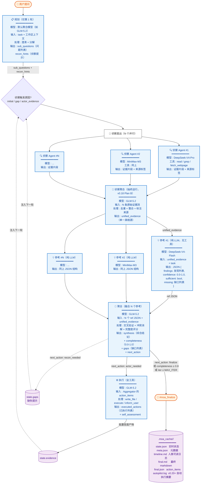

# vscode-moa Architecture（详细数据流）

> **Languages / 语言**: [中文](#中文版) | [English](#english-version)
>
> 本文档是 README.md / README.en.md 中简练流程图的详细版本，覆盖每个角色的输入 / 输出 / 模型 / 工具 / JSON 结构。
>
> This document is the detailed companion to the compact pipeline diagram in the README files, covering per-role input / output / model / tools / JSON shape.

---

## 中文版

### 完整数据流图



### Recon Aggregator → Refs → Aggregator 数据契约

这是用户最关心的"中间数据如何流动"问题。三阶段的数据形状：

#### 阶段 2.5：Recon Aggregator 输出（`recon_aggregator.json`）

```json
{
  "unified_evidence": [
    {
      "content": "文件 X 的第 30-50 行内容...",
      "source": "src/foo.ts:30-50",
      "recon_agent": "advisor_1",
      "recon_model": "DeepSeek-V4-Pro",
      "relevance": 0.92
    }
  ],
  "stats": {
    "raw_chunks": 47,
    "deduped_chunks": 31,
    "source_files": 12
  }
}
```

- `unified_evidence` 是 N 个 Recon Agent 输出去重后的单一来源
- 每条证据保留原始 `recon_agent` + `recon_model` 标签，便于追溯

#### 阶段 3：Refs 输入/输出（每个 `refs/advisor_N__<model>.json`）

**输入**（不写入文件，由 orchestrator 注入 prompt）：
- `unified_evidence`（来自 Recon Aggregator）
- `task`（来自用户原始提问）
- `sub_questions`（来自 Planner，仅 iter 1）

**输出**（每个 Ref Advisor 独立一份 JSON）：

```json
{
  "findings": [
    {
      "claim": "X 函数在 N 处被调用且未做空值检查",
      "evidence_refs": ["src/foo.ts:30-50", "src/bar.ts:120"],
      "confidence": 0.85
    }
  ],
  "overall_confidence": 0.78,
  "sufficient": false,
  "missing": [
    "X 函数的性能基准数据",
    "错误处理路径的覆盖率"
  ],
  "model": "DeepSeek-V4-Flash",
  "advisor_label": "advisor_1"
}
```

- 5 个 Ref Advisor（不同模型）并行产出，每份 JSON 结构相同
- `findings[].evidence_refs` 让下游 Aggregator 能追溯证据到 Recon 阶段的 `source`

#### 阶段 4：Aggregator 输出（`aggregator.json`）

```json
{
  "synthesis": "综合结论的 markdown 文本...",
  "completeness": 0.78,
  "completeness_delta": 0.15,
  "gaps": [
    "X 函数的性能基准数据",
    "错误处理路径的覆盖率"
  ],
  "conflicts_detected": [
    {
      "topic": "X 函数是否线程安全",
      "ref_advisors": ["advisor_1", "advisor_3"],
      "positions": ["线程安全", "非线程安全"],
      "resolution": "采纳 advisor_3 的非线程安全结论（有代码佐证）"
    }
  ],
  "merged_from_refs": ["advisor_1", "advisor_2", "advisor_3"],
  "next_action": "recon_needed",
  "model": "GLM-5.2"
}
```

- `synthesis` 是融合 N 个 Ref 的最终结论
- `completeness`（0.0-1.0）≥ 0.8 触发 finalize
- `next_action` 是收敛的真相源：`finalize` / `actor_needed` / `recon_needed`

### 角色一览（含 L3 Summarizer 子角色）

| 角色 | 顺序 | 运行时机 | 工具 | 默认模型 |
|---|---|---|---|---|
| **规划（Planner）** | 1（仅第 1 轮） | 总是 | 只读 | （聚合模型） |
| **侦察（Recon）** | 2 | 每 iter（除非 reconContext 已注入） | read / grep / fetch / 终端（可选） | DeepSeek-V4-Pro + MiniMax-M3 |
| **侦察聚合（Recon Aggregator）** | 2.5 | 总是在 Recon 之后运行 | 仅验证 | GLM-5.2 |
| **参考（Refs）** | 3 | 每 iter | 纯 LLM（无工具） | 3+ 不同模型 |
| **聚合（Aggregator）** | 4 | 每 iter | 纯 LLM | GLM-5.2 |
| **执行（Actor）** | 5 | 仅 `actor_needed` | 全工具 | GLM-5.2 |
| **L3 摘要器（L3 Summarizer）** | 孙角色 | 单文件 > 200k 字符触发 | 无 | MiniMax-M3 |

### 闭环设计（v0.15+）

- **Actor 反馈**：高置信度产物写入 `state.evidence`，下一轮 Recon 会读取
- **缺口反馈**：Aggregator 的 `gaps` 写入 `state.gaps`，驱动下一轮 Recon
- **收敛检测**：连续 3 轮 completeness Δ < 0.05 → 强制 finalize（失控保护）
- **硬上限**：`MAX_ITER=12`

### Loop 控制逻辑 + Autopilot 警告（v0.21.3+）

> ⚠️ **默认 `executionPreset="autopilot"` + `enableActorInLoop=true`**（v0.21.3 起的新装默认）。任务收敛后 Actor 会**自动执行** `action_items`（写文件、跑终端命令），安全网为 SafeExecutor 的 `.bak.<时间戳>` 备份 + `.moa_cache/<task_id>/manifest.json` 审计清单。

**`@moa` / `@moaloop` 多轮 loop**（5 角色，由 `moaOrchestrator` 控制）：

```
while (iter < MAX_ITER=12) {
  Planner (iter=1 only) → Recon (每 iter) → Refs (每 iter) → Aggregator
  switch (Aggregator.next_action) {
    case 'finalize':       → finalizeTask → (autopilot?) execute action_items → exit
    case 'actor_needed':   → Actor 执行 → evidence 入栈 → continue
    case 'recon_needed':   → continue（下轮 Recon 基于 gaps）
  }
  if (shouldStop()) → finalizeTask  // 失控保护
}
→ finalizeTask（MAX_ITER 强制）
```

**`@moasingle` 单次模式**（5 角色 1 轮，强制 finalize）：

```
Planner → Recon → Refs → Aggregator → finalizeTask → (autopilot?) execute
```

**单次任务内的 Recon 轮数**（`moa.maxReconRounds`，default=5）：

> ⚠️ 此项**不是** `@moa`/`@moaloop` 多轮 loop 的轮数（那个由 `MAX_ITER=12` 控制）。
> 它仅作用于 `@moasingle` + `moa_analyze` 工具路径（`moaRunner.runP1Fanout`）—— 在单次 MoA 任务内，当 refs 报告 `sufficient=false` 时触发新一轮 recon，最多 `maxReconRounds` 轮。

**执行预设与 Actor 自动执行**（v0.20.0+）：

| `executionPreset` | autoExecute | approvalMode | safeMode | 行为 |
|---|---|---|---|---|
| `manual` | ❌ false | batch | ✅ true | finalize 只返回 markdown，需显式 `#moa_execute` |
| `supervised` | ✅ true | batch（Gate-A） | ✅ true | 自动执行 + 入口批量 QuickPick 审批 |
| **`autopilot`（v0.21.3 默认）** | ✅ true | none | ✅ true | **全自动，零弹窗**，SafeExecutor 备份兜底 |
| `yolo` | ✅ true | none | ❌ false | 全自动 + 无备份（仅供沙盒/CI） |
| `custom` | — | — | — | 手动控制三个细粒度配置 |

回滚方法：原文件旁的 `.bak.<时间戳>` 文件 + `manifest.json` 记录所有变更。

### 角色注入系统大改造（v0.22.0+）

> 完整设计文档：[roadmap/v0.22.0-role-injection-overhaul.md](roadmap/v0.22.0-role-injection-overhaul.md)（v3 路线图）+ [moa-role-injection-design.md](moa-role-injection-design.md)（注入矩阵主总览）。

#### 三层分离（v0.22 架构核心）

v0.22 把所有调工具的角色（Planner / Recon / Actor）的 prompt 重构为 3 层叠加：

```
┌─────────────────────────────────────────┐
│ Layer 1: 基础设施层（Infrastructure）    │  systemContext.ts + instructionScanner.ts
│  ┌─ ENV_CONTEXT （activeFile/openDocs/  │  所有角色共享，按 mtime 缓存
│  │   workspaceFolders/projectTree/      │
│  │   gitRoot/instructionFiles 清单）    │
│  ├─ TOOL_EFFICIENCY （静态纪律模板）    │
│  ├─ CUSTOM_INSTRUCTIONS （7 路径扫描）   │  不截断，单文件 >200KB 给警告
│  └─ RUNTIME_INSTRUCTIONS （4 文件夹      │  SKILL.md frontmatter，全量给 Planner
│      skills 的清单）                     │
├─────────────────────────────────────────┤
│ Layer 2: 角色身份层（Role Identity）     │  roleSetupPreset.ts + Planner role_setup
│  Planner 通过 role_setup 字段设计下游    │  3 角色（recon/recon_aggregator/actor）
│  3 角色的 tone/perspective/tool_priority │  Refs/Aggregator 保留多模型可比性，
│  /cautions/focus                         │  不接受 role_setup（架构红线）
├─────────────────────────────────────────┤
│ Layer 3: 迭代状态层（Iteration State）   │  orchestrator state
│  iter_state / gaps / evidence /          │  每轮迭代动态变化
│  completeness_history                    │
└─────────────────────────────────────────┘
```

**基础设施层注入路径**（P0-2 + P0-3 + P0-5）：

| 角色 | ENV | TOOL_EFFICIENCY | CUSTOM_INSTRUCTIONS | RUNTIME_INSTRUCTIONS |
|---|---|---|---|---|
| Planner | ✅ 全量 | ✅ | ✅ 不截断 | ✅ 全量 skills 清单（推荐 + 排序给 Recon）|
| Recon | ✅ 全量 | ✅ | ✅ 不截断 | ✅ Planner 排序后的 tool_priority |
| Actor | ✅ 全量 | ✅ | ✅ 不截断 | ✅ Planner 排序后的 tool_priority |
| Refs | ❌ 精简版（可选 `renderEnvBrief`）| ❌ | ❌ | ❌ |
| Aggregator | ❌ | ❌ | ❌ | ❌ |

**7 路径指令文件扫描**（不截断，CLAUDE.md / AGENTS.md / copilot-instructions.md 等）：详见 [CONFIGURATION.md](CONFIGURATION.md) "Planner mini-loop" 章节。

#### Planner mini-loop + role_setup 输出（P0-1）

Planner 从"单次调用"升级为"可迭代 mini-loop"：

```
iter 1: Planner(task, systemContext, prev_coverage=undefined)
        → 输出 13 字段 JSON（含 plan_coverage / role_setup）
iter 2+: if plan_coverage < threshold AND iter < maxIter:
           Planner 允许调 read-only 工具（每轮 ≤3 次）
           → 输出更新后的 13 字段
         if plan_coverage < 0.5 AND iter ≥ 2:
           → ask_user（vscode_askQuestions 询问用户）
收敛：plan_coverage ≥ threshold OR iter ≥ maxIter OR ask_user
```

**PlannerOutput schema（v0.22，13 字段，向后兼容）**：

```jsonc
{
  // v0.21 及之前字段（保留）
  "sub_questions": [...],
  "recon_hints": {...},
  "difficulty": "simple|medium|hard|engineering",
  "recon_required": true,
  "actor_needed": false,
  "needs_iteration": true,
  // v0.22 新增 7 字段（全部可选）
  "task_type": "research|coding|documentation|analysis|hybrid",
  "process_language": "zh-CN|en|mixed|ja|...",  // Planner 决定全流程语言
  "plan_coverage": 0.92,                          // 0.0-1.0，自评完整度
  "needs_replan": false,                          // 最后一轮是否建议再迭代
  "ask_user": false,                              // 是否需询问用户
  "ask_user_questions": ["..."],                  // 仅 ask_user=true 时
  "role_setup": {                                 // 下游 3 角色身份设计
    "recon": { "tone": "...", "perspective": "...", "tool_priority": [...], "cautions": [...], "focus": [...] },
    "recon_aggregator": { /* 同上 */ },
    "actor": { /* 同上 */ }
    // 注意：无 refs / aggregator（架构红线，保留多模型可比性）
  }
}
```

#### Recon Aggregator 始终运行 + 自迭代（P0-4 + P0-9）

v0.18 起 Recon Aggregator 在 parallel 模式下运行；**v0.22 起无论 single 还是 parallel 都运行**（统一证据清洁度）。

```
N 个 Recon Agent 并行 → 原始 evidence_chunks 落盘（便于复盘）
                     → Recon Aggregator（始终运行）
                         ├─ mode='default':  内置静态 prompt
                         └─ mode='planner':  Planner 的 role_setup.recon_aggregator 覆盖
                     └─ 自迭代（maxIters 默认 1，最大 10）
                         ├─ maxIters=1:  单次，不评分
                         └─ maxIters>1:  每轮启发式评分（aggregation + fidelity）
                                         综合分 ≥ 0.85 收敛
```

**启发式评分（零额外 LLM 成本）**：详见 [CONFIGURATION.md](CONFIGURATION.md) "Recon Aggregator self-iteration" 章节。

#### Role Setup Preset 用户主权系统（P0-7）

用户可通过 `~/.moa/role-setup-presets.json` 全局持久化自己的 Role Setup Preset：

```
~/.moa/role-setup-presets.json
  ├─ default（内置，不可删除）
  └─ <user_preset_1>（用户基于 default 修改）
  └─ <user_preset_2>
  └─ <imported_from_community>（社区分享）
```

**8 + 3 命令**：CRUD（create/switch/edit/delete）+ 分享（export/import）+ AI 主权开关（toggleAIGeneration）+ Plan Mode 报告（togglePlanModeReport/showPlanModeReport）+ final.md 内嵌（toggleFinalMdInlineDisplay）+ 12 项环境检查（diagnoseEnvironment）。详见 [README.md](../README.md) "v0.22 命令" 章节。

#### Plan Mode 报告（P0-8）+ final.md 分级内嵌（P0-10）

- **Plan Mode 报告**：`moa.planModeReport.enabled=true` 时，Planner mini-loop 收敛后弹 `vscode_askQuestions` 报告 plan + role_setup + 状态（**不**含 token 估算）
- **final.md 内嵌**：task complete 时按 final.md 长度自适应展示到主会话（`full` < 2000 字符 / `summary` 2000-8000 / `structured-summary` > 8000），让下一轮对话无需工具调用即可获取上下文

---

## English Version

### Full Data Flow Diagram


### Recon Aggregator → Refs → Aggregator Data Contract

This is the "how does intermediate data flow" question in detail. Three stages:

#### Stage 2.5: Recon Aggregator output (`recon_aggregator.json`)

```json
{
  "unified_evidence": [
    {
      "content": "Lines 30-50 of file X...",
      "source": "src/foo.ts:30-50",
      "recon_agent": "advisor_1",
      "recon_model": "DeepSeek-V4-Pro",
      "relevance": 0.92
    }
  ],
  "stats": {
    "raw_chunks": 47,
    "deduped_chunks": 31,
    "source_files": 12
  }
}
```

- `unified_evidence` is the deduplicated single source from N Recon Agents
- Each evidence item retains original `recon_agent` + `recon_model` labels for traceability

#### Stage 3: Refs input/output (per `refs/advisor_N__<model>.json`)

**Input** (not written to file; injected by orchestrator into prompt):
- `unified_evidence` (from Recon Aggregator)
- `task` (original user prompt)
- `sub_questions` (from Planner, iter 1 only)

**Output** (each Ref Advisor produces independent JSON):

```json
{
  "findings": [
    {
      "claim": "Function X is called in N places without null check",
      "evidence_refs": ["src/foo.ts:30-50", "src/bar.ts:120"],
      "confidence": 0.85
    }
  ],
  "overall_confidence": 0.78,
  "sufficient": false,
  "missing": [
    "Performance benchmarks for function X",
    "Error path coverage"
  ],
  "model": "DeepSeek-V4-Flash",
  "advisor_label": "advisor_1"
}
```

- 5 Ref Advisors (different models) produce parallel outputs, all with same JSON shape
- `findings[].evidence_refs` lets downstream Aggregator trace back to Recon's `source`

#### Stage 4: Aggregator output (`aggregator.json`)

```json
{
  "synthesis": "Markdown text of the synthesized conclusion...",
  "completeness": 0.78,
  "completeness_delta": 0.15,
  "gaps": [
    "Performance benchmarks for function X",
    "Error path coverage"
  ],
  "conflicts_detected": [
    {
      "topic": "Is function X thread-safe",
      "ref_advisors": ["advisor_1", "advisor_3"],
      "positions": ["thread-safe", "not thread-safe"],
      "resolution": "Adopted advisor_3's not-thread-safe conclusion (code-backed)"
    }
  ],
  "merged_from_refs": ["advisor_1", "advisor_2", "advisor_3"],
  "next_action": "recon_needed",
  "model": "GLM-5.2"
}
```

- `synthesis` is the final fused conclusion from N Refs
- `completeness` (0.0-1.0) ≥ 0.8 triggers finalize
- `next_action` is the source of truth for convergence: `finalize` / `actor_needed` / `recon_needed`

### Roles overview (incl. L3 Summarizer sub-role)

| Role | Order | When | Tools | Default model |
|---|---|---|---|---|
| **Planner** | 1 (iter 1 only) | Always | Read-only | (aggregator model) |
| **Recon** | 2 | Every iter (unless reconContext pre-injected) | read / grep / fetch / terminal (opt-in) | DeepSeek-V4-Pro + MiniMax-M3 |
| **Recon Aggregator** | 2.5 | Always after Recon | Verify-only | GLM-5.2 |
| **Refs** | 3 | Every iter | Pure LLM (no tools) | 3+ different models |
| **Aggregator** | 4 | Every iter | Pure LLM | GLM-5.2 |
| **Actor** | 5 | Only on `actor_needed` | Full tool access | GLM-5.2 |
| **L3 Summarizer** | Grandchild | Triggered when single file > 200k chars | None | MiniMax-M3 |

### Closed-loop design (v0.15+)

- **Actor feedback**: High-confidence artifacts written to `state.evidence`; next iter's Recon reads them
- **Gap feedback**: Aggregator's `gaps` written to `state.gaps`; drives next iter's Recon
- **Convergence detection**: 3 consecutive iters with completeness Δ < 0.05 → force finalize (runaway protection)
- **Hard cap**: `MAX_ITER=12`

### Loop control logic + Autopilot warning (v0.21.3+)

> ⚠️ **Defaults to `executionPreset="autopilot"` + `enableActorInLoop=true`** (v0.21.3+ new-install default). After convergence, the Actor role **automatically executes** `action_items` (write files, run terminal). Safety net = SafeExecutor `.bak.<timestamp>` backup + `.moa_cache/<task_id>/manifest.json` audit trail.

**`@moa` / `@moaloop` multi-iteration loop** (5-role, controlled by `moaOrchestrator`):

```
while (iter < MAX_ITER=12) {
  Planner (iter=1 only) → Recon (every iter) → Refs (every iter) → Aggregator
  switch (Aggregator.next_action) {
    case 'finalize':       → finalizeTask → (autopilot?) execute action_items → exit
    case 'actor_needed':   → Actor executes → evidence appended → continue
    case 'recon_needed':   → continue (next Recon based on gaps)
  }
  if (shouldStop()) → finalizeTask  // runaway protection
}
→ finalizeTask (MAX_ITER forced)
```

**`@moasingle` single-shot mode** (5 roles, 1 iter, forced finalize):

```
Planner → Recon → Refs → Aggregator → finalizeTask → (autopilot?) execute
```

**Recon rounds within a single MoA task** (`moa.maxReconRounds`, default=5):

> ⚠️ This is **NOT** the `@moa`/`@moaloop` multi-iteration loop counter (that's `MAX_ITER=12`).
> It only applies to the `@moasingle` + `moa_analyze` tool path (`moaRunner.runP1Fanout`) — within a single MoA task, when refs report `sufficient=false`, a new recon round is triggered, up to `maxReconRounds` rounds.

**Execution presets & Actor auto-execution** (v0.20.0+):

| `executionPreset` | autoExecute | approvalMode | safeMode | Behavior |
|---|---|---|---|---|
| `manual` | ❌ false | batch | ✅ true | finalize returns markdown only; explicit `#moa_execute` required |
| `supervised` | ✅ true | batch (Gate-A) | ✅ true | auto-execute + entry QuickPick approval |
| **`autopilot` (v0.21.3 default)** | ✅ true | none | ✅ true | **fully automatic, zero popups**, SafeExecutor backup |
| `yolo` | ✅ true | none | ❌ false | fully automatic + no backup (sandbox/CI only) |
| `custom` | — | — | — | manually control three fine-grained configs |

Rollback: original files' `.bak.<timestamp>` siblings + `manifest.json` records all changes.
