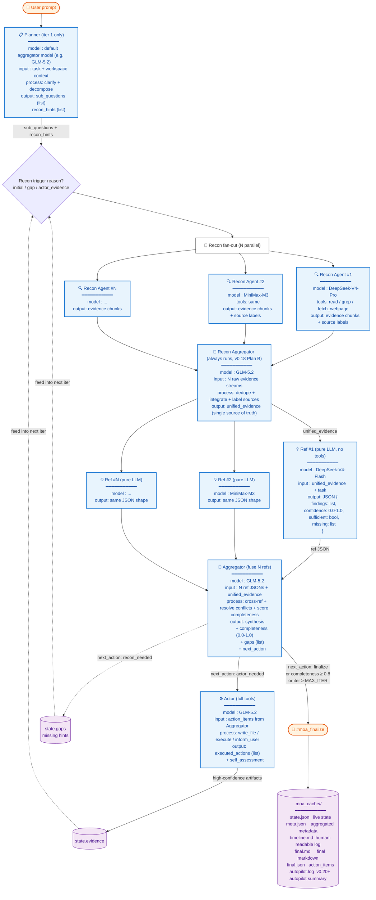

# vscode-moa Architecture（详细数据流）

> **Languages / 语言**: [中文](#中文版) | [English](#english-version)
>
> 本文档是 README.md / README.en.md 中简练流程图的详细版本，覆盖每个角色的输入 / 输出 / 模型 / 工具 / JSON 结构。
>
> This document is the detailed companion to the compact pipeline diagram in the README files, covering per-role input / output / model / tools / JSON shape.

---

## 中文版

### 完整数据流图


### Recon Aggregator → Refs → Aggregator 数据契约

这是用户最关心的"中间数据如何流动"问题。三阶段的数据形状：

#### 阶段 2.5：Recon Aggregator 输出（`recon_aggregator.json`）

```json
{
  "unified_evidence": [
    {
      "content": "文件 X 的第 30-50 行内容...",
      "source": "src/foo.ts:30-50",
      "recon_agent": "advisor_1",
      "recon_model": "DeepSeek-V4-Pro",
      "relevance": 0.92
    }
  ],
  "stats": {
    "raw_chunks": 47,
    "deduped_chunks": 31,
    "source_files": 12
  }
}
```

- `unified_evidence` 是 N 个 Recon Agent 输出去重后的单一来源
- 每条证据保留原始 `recon_agent` + `recon_model` 标签，便于追溯

#### 阶段 3：Refs 输入/输出（每个 `refs/advisor_N__<model>.json`）

**输入**（不写入文件，由 orchestrator 注入 prompt）：
- `unified_evidence`（来自 Recon Aggregator）
- `task`（来自用户原始提问）
- `sub_questions`（来自 Planner，仅 iter 1）

**输出**（每个 Ref Advisor 独立一份 JSON）：

```json
{
  "findings": [
    {
      "claim": "X 函数在 N 处被调用且未做空值检查",
      "evidence_refs": ["src/foo.ts:30-50", "src/bar.ts:120"],
      "confidence": 0.85
    }
  ],
  "overall_confidence": 0.78,
  "sufficient": false,
  "missing": [
    "X 函数的性能基准数据",
    "错误处理路径的覆盖率"
  ],
  "model": "DeepSeek-V4-Flash",
  "advisor_label": "advisor_1"
}
```

- 5 个 Ref Advisor（不同模型）并行产出，每份 JSON 结构相同
- `findings[].evidence_refs` 让下游 Aggregator 能追溯证据到 Recon 阶段的 `source`

#### 阶段 4：Aggregator 输出（`aggregator.json`）

```json
{
  "synthesis": "综合结论的 markdown 文本...",
  "completeness": 0.78,
  "completeness_delta": 0.15,
  "gaps": [
    "X 函数的性能基准数据",
    "错误处理路径的覆盖率"
  ],
  "conflicts_detected": [
    {
      "topic": "X 函数是否线程安全",
      "ref_advisors": ["advisor_1", "advisor_3"],
      "positions": ["线程安全", "非线程安全"],
      "resolution": "采纳 advisor_3 的非线程安全结论（有代码佐证）"
    }
  ],
  "merged_from_refs": ["advisor_1", "advisor_2", "advisor_3"],
  "next_action": "recon_needed",
  "model": "GLM-5.2"
}
```

- `synthesis` 是融合 N 个 Ref 的最终结论
- `completeness`（0.0-1.0）≥ 0.8 触发 finalize
- `next_action` 是收敛的真相源：`finalize` / `actor_needed` / `recon_needed`

### 角色一览（含 L3 Summarizer 子角色）

| 角色 | 顺序 | 运行时机 | 工具 | 默认模型 |
|---|---|---|---|---|
| **规划（Planner）** | 1（仅第 1 轮） | 总是 | 只读 | （聚合模型） |
| **侦察（Recon）** | 2 | 每 iter（除非 reconContext 已注入） | read / grep / fetch / 终端（可选） | DeepSeek-V4-Pro + MiniMax-M3 |
| **侦察聚合（Recon Aggregator）** | 2.5 | 总是在 Recon 之后运行 | 仅验证 | GLM-5.2 |
| **参考（Refs）** | 3 | 每 iter | 纯 LLM（无工具） | 3+ 不同模型 |
| **聚合（Aggregator）** | 4 | 每 iter | 纯 LLM | GLM-5.2 |
| **执行（Actor）** | 5 | 仅 `actor_needed` | 全工具 | GLM-5.2 |
| **L3 摘要器（L3 Summarizer）** | 孙角色 | 单文件 > 200k 字符触发 | 无 | MiniMax-M3 |

### 闭环设计（v0.15+）

- **Actor 反馈**：高置信度产物写入 `state.evidence`，下一轮 Recon 会读取
- **缺口反馈**：Aggregator 的 `gaps` 写入 `state.gaps`，驱动下一轮 Recon
- **收敛检测**：连续 3 轮 completeness Δ < 0.05 → 强制 finalize（失控保护）
- **硬上限**：`MAX_ITER=12`

---

## English Version

### Full Data Flow Diagram



### Recon Aggregator → Refs → Aggregator Data Contract

This is the "how does intermediate data flow" question in detail. Three stages:

#### Stage 2.5: Recon Aggregator output (`recon_aggregator.json`)

```json
{
  "unified_evidence": [
    {
      "content": "Lines 30-50 of file X...",
      "source": "src/foo.ts:30-50",
      "recon_agent": "advisor_1",
      "recon_model": "DeepSeek-V4-Pro",
      "relevance": 0.92
    }
  ],
  "stats": {
    "raw_chunks": 47,
    "deduped_chunks": 31,
    "source_files": 12
  }
}
```

- `unified_evidence` is the deduplicated single source from N Recon Agents
- Each evidence item retains original `recon_agent` + `recon_model` labels for traceability

#### Stage 3: Refs input/output (per `refs/advisor_N__<model>.json`)

**Input** (not written to file; injected by orchestrator into prompt):
- `unified_evidence` (from Recon Aggregator)
- `task` (original user prompt)
- `sub_questions` (from Planner, iter 1 only)

**Output** (each Ref Advisor produces independent JSON):

```json
{
  "findings": [
    {
      "claim": "Function X is called in N places without null check",
      "evidence_refs": ["src/foo.ts:30-50", "src/bar.ts:120"],
      "confidence": 0.85
    }
  ],
  "overall_confidence": 0.78,
  "sufficient": false,
  "missing": [
    "Performance benchmarks for function X",
    "Error path coverage"
  ],
  "model": "DeepSeek-V4-Flash",
  "advisor_label": "advisor_1"
}
```

- 5 Ref Advisors (different models) produce parallel outputs, all with same JSON shape
- `findings[].evidence_refs` lets downstream Aggregator trace back to Recon's `source`

#### Stage 4: Aggregator output (`aggregator.json`)

```json
{
  "synthesis": "Markdown text of the synthesized conclusion...",
  "completeness": 0.78,
  "completeness_delta": 0.15,
  "gaps": [
    "Performance benchmarks for function X",
    "Error path coverage"
  ],
  "conflicts_detected": [
    {
      "topic": "Is function X thread-safe",
      "ref_advisors": ["advisor_1", "advisor_3"],
      "positions": ["thread-safe", "not thread-safe"],
      "resolution": "Adopted advisor_3's not-thread-safe conclusion (code-backed)"
    }
  ],
  "merged_from_refs": ["advisor_1", "advisor_2", "advisor_3"],
  "next_action": "recon_needed",
  "model": "GLM-5.2"
}
```

- `synthesis` is the final fused conclusion from N Refs
- `completeness` (0.0-1.0) ≥ 0.8 triggers finalize
- `next_action` is the source of truth for convergence: `finalize` / `actor_needed` / `recon_needed`

### Roles overview (incl. L3 Summarizer sub-role)

| Role | Order | When | Tools | Default model |
|---|---|---|---|---|
| **Planner** | 1 (iter 1 only) | Always | Read-only | (aggregator model) |
| **Recon** | 2 | Every iter (unless reconContext pre-injected) | read / grep / fetch / terminal (opt-in) | DeepSeek-V4-Pro + MiniMax-M3 |
| **Recon Aggregator** | 2.5 | Always after Recon | Verify-only | GLM-5.2 |
| **Refs** | 3 | Every iter | Pure LLM (no tools) | 3+ different models |
| **Aggregator** | 4 | Every iter | Pure LLM | GLM-5.2 |
| **Actor** | 5 | Only on `actor_needed` | Full tool access | GLM-5.2 |
| **L3 Summarizer** | Grandchild | Triggered when single file > 200k chars | None | MiniMax-M3 |

### Closed-loop design (v0.15+)

- **Actor feedback**: High-confidence artifacts written to `state.evidence`; next iter's Recon reads them
- **Gap feedback**: Aggregator's `gaps` written to `state.gaps`; drives next iter's Recon
- **Convergence detection**: 3 consecutive iters with completeness Δ < 0.05 → force finalize (runaway protection)
- **Hard cap**: `MAX_ITER=12`
